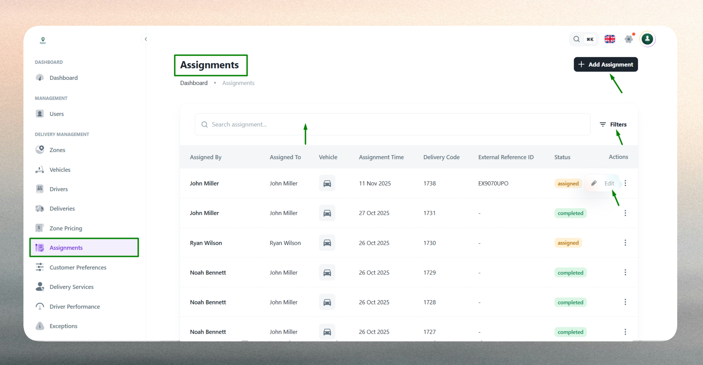
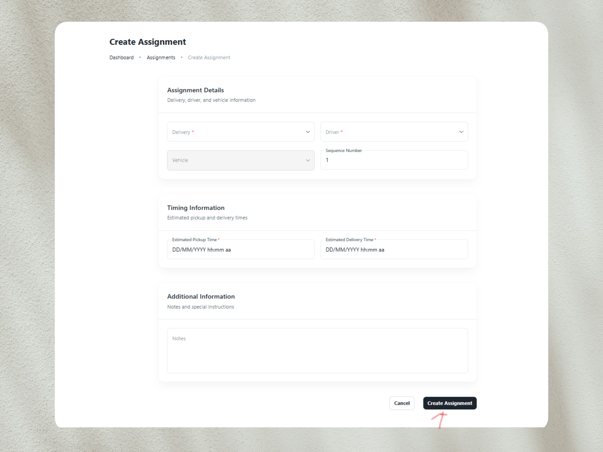
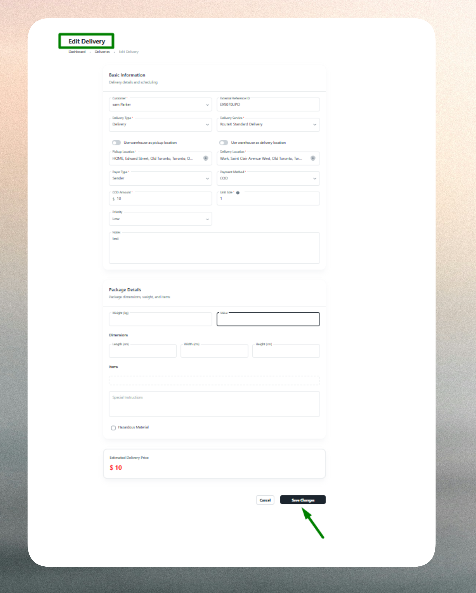

# Assignments

## What is an Assignment?

An Assignment is the operational link between a delivery order, a driver, and a vehicle. It represents the dispatch action that allocates a specific delivery to qualified personnel and appropriate transport, tracking who is responsible, when the assignment was created, and how it progresses through the delivery lifecycle.

Each assignment captures essential details including the assigning user, assigned driver, vehicle used, timing information, and the related delivery order code. This structure ensures accountability, enables real‑time status tracking, and provides visibility into driver workloads and delivery progress from dispatch to completion.

::::note
Screenshot placeholder: Assignment details view
::::

## Assignment List

The Assignment List provides a comprehensive view of all delivery assignments in the system, whether manually created by dispatchers or automatically generated by routing algorithms.

Use the list to monitor active deliveries, verify driver workloads, and manage dispatch operations. The interface includes:

- **Search functionality**: Quickly locate assignments by delivery code, driver name, or vehicle identifier.
- **Filtering options**: Filter assignments by status (Assigned, Pickup, In‑Transit, Completed), date range, driver, vehicle, or zone.
- **Sorting capabilities**: Sort by assignment time, expected delivery time, status, or driver name.
- **Quick actions**: Access assignment details, view delivery information, or track real‑time progress directly from the list.

The list displays key information such as assigned by (dispatcher), assigned to (driver), vehicle, assignment time, delivery code, and current status for easy reference and workload monitoring.

Assignments progress through a fixed status flow as deliveries move through their lifecycle: Assigned (allocated but not started), Pickup (collecting package from origin), In‑Transit (en route to destination), and Completed (delivery finished and confirmed). This status tracking enables real‑time monitoring of each delivery's journey and helps operations teams resolve issues proactively.

## Create a New Assignment

Creating an assignment requires linking three core entities—a delivery order, a driver, and a vehicle—along with timing and instructional information to ensure proper dispatch execution.

### Delivery Selection

Select the delivery order to assign. This links the assignment to the correct shipment and ensures tracking continuity from order creation through completion. The system validates that the delivery is eligible for assignment and not already actively assigned to prevent duplication.

### Driver & Vehicle Selection

Choose the driver responsible for executing the delivery and the vehicle to be used. The system considers driver availability, zone assignments, license compliance, and vehicle capacity to ensure proper matching. Driver selection establishes clear ownership for performance tracking and accountability, while vehicle selection ensures capacity and delivery requirements align with available transport resources.

Zone-based assignments may restrict driver and vehicle options to those assigned to the delivery's service zone, improving route efficiency and workload distribution.

### Timing & Scheduling

Specify when the assignment is created or becomes effective through the assignment time field. Optionally provide an expected delivery time to improve forecasting and customer expectations. These timestamps help optimize dispatch schedules, support route planning, and enable delivery window commitments.

### Instructions & Notes

Add special instructions or comments for the driver to communicate unique delivery conditions, customer preferences, access requirements, or handling instructions. While optional, notes reduce communication gaps and improve delivery success rates by providing context that may not be captured in standard delivery fields.

### Validation

The system validates all required fields and enforces business rules. Delivery, driver, and vehicle selections are mandatory. Assignment time must be valid and cannot be empty. Duplicate active assignments for the same delivery are not allowed. The system highlights missing or invalid inputs for correction before submission.

## Edit an Existing Assignment

Assignment profiles can be updated to reflect changes in dispatch plans, driver availability, or operational requirements, though edit capabilities vary depending on the assignment's current status.

Common updates include:

- **Driver reassignment**: Change the assigned driver based on availability, workload balancing, or skill requirements. Reassignment is typically allowed only before the driver begins pickup.
- **Vehicle changes**: Update the assigned vehicle to accommodate capacity adjustments, vehicle availability, or special requirements. Vehicle changes are generally restricted once the driver has started the delivery.
- **Timing adjustments**: Modify assignment time or expected delivery time to reflect updated schedules or customer requests.
- **Instruction updates**: Add or modify notes to provide additional context, change delivery instructions, or communicate special requirements.
- **Status progression**: Update assignment status as the delivery progresses (Assigned → Pickup → In‑Transit → Completed). Status updates typically follow a strict sequence and may be restricted to prevent backward status changes.

Certain edits may be restricted based on assignment status to maintain data integrity and prevent conflicts with in‑progress deliveries. For example, completed assignments may only allow note additions for record-keeping purposes. The system retains historical assignment data for reporting, auditing, and performance analysis.

::::note
Monitor assignment statuses regularly to ensure on‑time completion and identify potential delivery issues early. Use filtering and sorting to focus on critical assignments.
::::

::::tip
Verify driver and vehicle availability before creating assignments. Match vehicle capacity to package size and delivery requirements to prevent overloading and ensure efficient resource utilization.
::::

::::info
Add detailed notes to assignments for complex deliveries, special handling requirements, or unique customer instructions. This reduces communication gaps and improves delivery success rates.
::::

