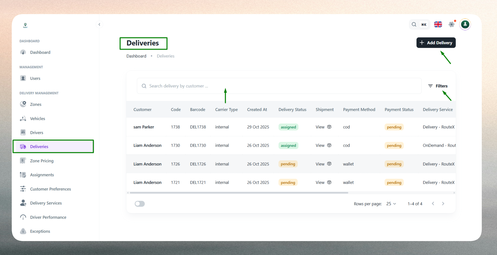
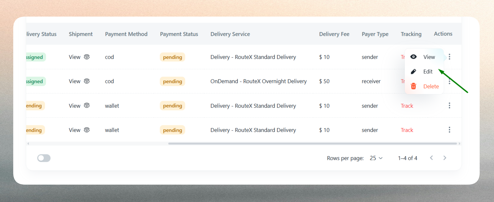
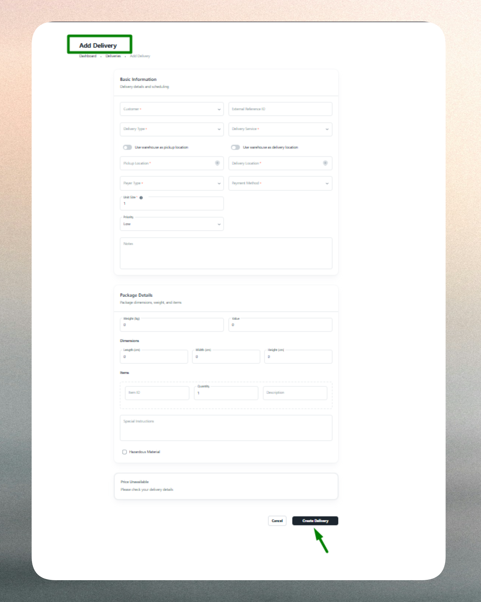

# Deliveries

## What is a Delivery?

A delivery represents an individual shipment order created to transport goods or packages from a pickup location to a drop‑off location. Each delivery profile includes customer information, service type, locations, package details, payment method, and operational status. Deliveries form the backbone of the logistics workflow, linking drivers, vehicles, zones, and delivery services into one coordinated dispatch and tracking process.

## Delivery List

The Delivery List provides a comprehensive view of all delivery orders created in the system, whether manually entered by dispatchers, generated from customer apps, or created through API integrations.

Use the list to monitor order status, track delivery progress, and manage dispatch operations. The interface includes:

- **Search functionality**: Quickly locate deliveries by delivery code, customer name, or tracking number.
- **Filtering options**: Filter deliveries by status (Pending, Assigned, Pickup, In‑Transit, Delivered), date range, delivery service, zone, or payment method.
- **Sorting capabilities**: Sort by creation date, delivery time, priority level, or customer name.
- **Quick actions**: Access delivery details, track real‑time progress, or view assignment information directly from the list.

The list displays key information such as delivery code, customer, service type, pickup and drop‑off locations, priority, current status, and assigned driver for easy reference and monitoring.

Deliveries progress through a lifecycle as they move from creation to completion: Pending (order created but not assigned), Assigned (allocated to a driver), Pickup (driver collecting package), In‑Transit (en route to destination), and Delivered (successfully completed). This status tracking enables real‑time monitoring and helps operations teams manage dispatch workflows and resolve issues proactively.

## Create a New Delivery

Creating a delivery requires entering key information across several categories to ensure accurate dispatch, tracking, and billing.

### Customer & Service Details

Select the customer requesting the delivery to link the order to the correct account for billing and tracking purposes. Choose the appropriate delivery service from available options such as Express, Same Day, or Economy. The selected service determines pricing calculations, time estimates, zone eligibility, and service type (Pickup Only, Delivery Only, or Both).

### Locations

Specify the pickup location where the package will be collected and the drop‑off location where it should be delivered. Both addresses must be valid, complete, and distinct. Pickup location ensures drivers start from the correct origin point, while drop‑off location defines the destination for tracking and completion verification. The system may validate zone coverage based on the selected delivery service.

### Package & Unit Details

Define the package characteristics including unit size (quantity, weight, or volume), package type or material classification, and a description of contents. Unit size affects pricing calculations, vehicle capacity matching, and service eligibility. Package details help drivers identify and verify items during pickup and drop‑off, ensuring accurate handling and reducing delivery errors.

### Payment Information

Select the payment method for the delivery transaction such as Prepaid, Cash on Delivery (COD), Wallet, or Credit Account. The payment method determines how the transaction will be billed, recorded, and settled, and may affect driver cash collection responsibilities and customer invoicing.

### Priority & Instructions

Assign a priority level (Normal, High, or Urgent) to influence dispatch order and delivery scheduling. Higher priority deliveries may receive faster assignment and preferential routing. Add optional notes or special instructions to communicate unique delivery conditions, customer preferences, access requirements, or handling instructions to drivers.

### Validation

The system validates all required fields and enforces business rules. Customer and delivery service selections are mandatory. Pickup and drop‑off locations must be valid, complete, and distinct. Unit size must be a positive value. Payment method is required. For High or Urgent priority deliveries, the system may verify driver and vehicle availability. Any validation errors are highlighted for correction before submission.

## Edit an Existing Delivery

Delivery profiles can be updated to reflect changes in customer requests, operational requirements, or dispatch plans, though edit capabilities vary depending on the delivery's current status.

Common updates include:

- **Status progression**: Update delivery status as the order moves through its lifecycle (Pending → Assigned → Pickup → In‑Transit → Delivered). Status updates typically follow a strict sequence and may be automated through driver app interactions.
- **Assignment changes**: Modify or reassign the delivery to a different driver or vehicle based on availability, workload balancing, or operational needs. Reassignment is typically allowed before delivery completion.
- **Delivery window adjustments**: Update expected pickup or delivery times to reflect schedule changes or customer requests.
- **Location corrections**: Modify pickup or drop‑off addresses if initial information was incorrect or customer updates are received.
- **Priority changes**: Adjust priority level based on changing business requirements or customer urgency.
- **Instruction updates**: Add or modify notes to provide additional context, change delivery instructions, or communicate special requirements to drivers.
- **Package detail corrections**: Update unit size, package type, or contents description to reflect accurate information.

Certain edits may be restricted based on delivery status to maintain data integrity and prevent conflicts with in‑progress deliveries. For example, completed deliveries may only allow note additions for record-keeping purposes. The system retains historical delivery data for reporting, auditing, and performance analysis.

::::note
Monitor delivery statuses regularly to ensure on‑time completion and identify potential issues early. Use filtering and sorting to focus on critical deliveries or specific service types.
::::

::::tip
Verify pickup and drop‑off addresses before creating deliveries to prevent routing errors and failed delivery attempts. Match delivery service and priority to actual customer expectations and SLA requirements.
::::

::::info
Keep package details accurate and complete for compliance verification and successful deliveries. Use High or Urgent priority sparingly to maintain operational efficiency and avoid overburdening dispatch teams.
::::

