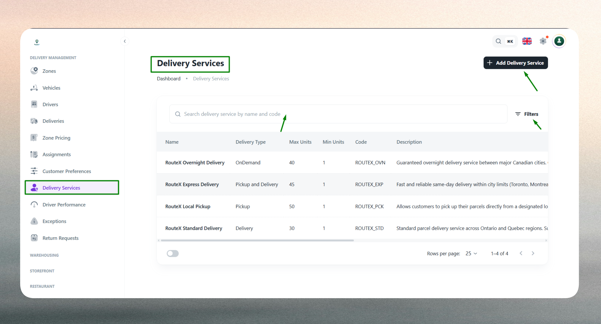
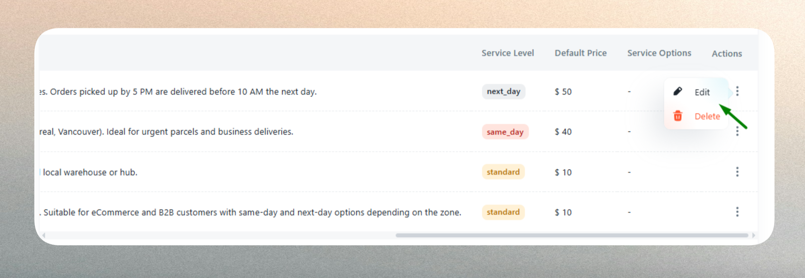
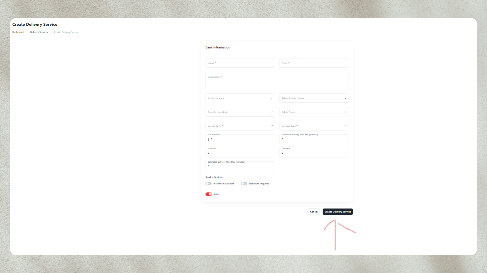
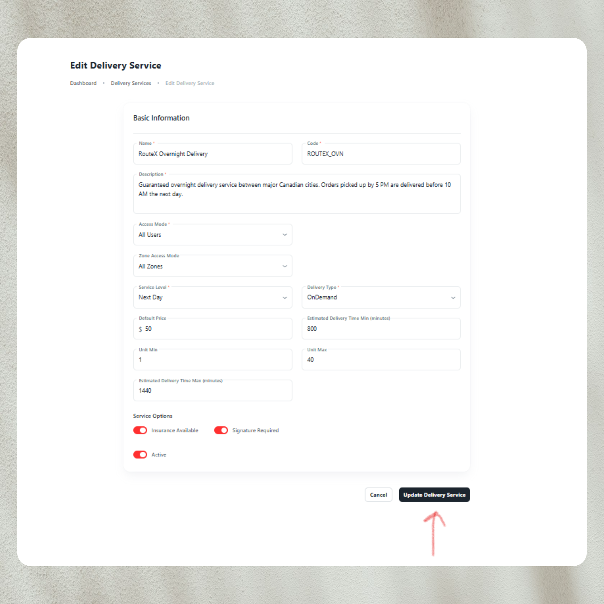

## What is a Delivery Service

A Delivery Service represents a distinct offering that defines how deliveries are executed within your logistics operations. Each service — such as Economy, Express, Same Day, or On‑Demand — acts as a configurable template that controls pricing, speed, access permissions, and operational parameters.

Delivery Services enable businesses to offer multiple fulfillment options tailored to different customer needs, urgency levels, and pricing structures. By defining services separately, you maintain operational flexibility while ensuring consistency across delivery workflows.

### Core Characteristics

Each Delivery Service includes:

- **Identity Information**: Name, unique code, and description for recognition and tracking
- **Access Control**: Rules determining which customers or user groups can access the service
- **Service Level**: Priority tier (Economy, Express, On‑Demand) affecting speed and dispatch logic
- **Delivery Type**: Operational mode (Delivery, Pickup, Pickup & Delivery, or On‑Demand)
- **Pricing Structure**: Default rates and compatibility with zone-based pricing
- **Capacity Constraints**: Unit limits controlling minimum and maximum order sizes
- **Time Expectations**: Estimated delivery windows for customer transparency

### Common Use Cases

- **Economy Delivery**: Standard 2–3 day fulfillment at lower cost for non-urgent shipments
- **Express Delivery**: Same‑day or next‑day service commanding premium pricing
- **On‑Demand Delivery**: Real‑time dispatch through driver app for immediate needs
- **VIP Service**: Exclusive offering with custom pricing available only to select customers

---

## Delivery Service List

The Delivery Service List provides a centralized view of all configured delivery offerings within your system. This interface allows you to monitor, compare, and manage multiple service types from a single location.

### Overview

The list displays essential attributes for each service:

- **Service Name**: Customer-facing identifier
- **Service Code**: Unique system identifier for API and backend operations
- **Service Level**: Priority classification (Economy, Express, On‑Demand)
- **Delivery Type**: Operational workflow designation
- **Status**: Active or inactive state
- **Access Control**: User accessibility settings

### Filtering and Search

The interface supports efficient navigation through:

- **Search Functionality**: Locate services by name or code
- **Filter by Service Level**: View only Economy, Express, or On‑Demand services
- **Filter by Delivery Type**: Isolate services by operational mode
- **Status Filter**: Show active, inactive, or all services
- **Sort Options**: Organize by name, creation date, or service level

These tools help administrators quickly identify and manage services, especially when operating multiple concurrent offerings across different customer segments or regions.

---

## Create a New Delivery Service

Creating a Delivery Service establishes a new fulfillment option within your logistics framework. This process involves defining the service's operational parameters, access rules, and pricing structure to align with your business strategy.

### Purpose of Service Configuration

New services are created to:

- **Expand Offerings**: Introduce new delivery speeds or specialized services
- **Segment Customers**: Create exclusive options for premium or wholesale clients
- **Support Regions**: Configure region-specific services with distinct pricing or time estimates
- **Test Operations**: Trial new delivery models before full deployment

### Key Configuration Parameters

#### Basic Information

Establishes the service's identity and purpose:

- **Service Name**: The customer-facing label that appears during service selection. Choose clear, descriptive names that communicate value (e.g., "Express Same Day", "Economy Ground")
- **Service Code**: A unique alphanumeric identifier used for system tracking, API integration, and reporting. Consistent coding schemes improve maintainability
- **Description**: Internal or customer-facing explanation of service features, ideal use cases, and differentiators

#### Access Control

Determines service availability across your customer base:

- **All Users**: Universal availability for standard offerings
- **Select Users**: Restricts access to specific customers or business accounts — useful for negotiated rates or specialized services
- **All Users Except Selected**: Enables broad access while excluding particular users, such as customers with incompatible contracts

Access control supports tiered service models, VIP programs, and contract-based restrictions without requiring separate systems.

#### Service Level

Defines the priority and speed classification:

- **Economy**: Lower priority with extended delivery windows and reduced costs
- **Express**: High priority with accelerated fulfillment and premium pricing
- **On‑Demand**: Immediate dispatch with real-time driver assignment

Service levels influence dispatch logic, driver assignment priorities, and customer expectations. They also integrate with zone-based pricing structures to calculate appropriate charges.

#### Delivery Type

Specifies the operational workflow:

- **Delivery**: Standard hub-to-customer fulfillment
- **Pickup**: Customer-initiated collection from designated locations
- **Pickup & Delivery**: Combines both pickup and delivery operations in a single service
- **On‑Demand**: Flexible, driver-initiated dispatch without fixed schedules

The delivery type determines how orders flow through your system, which resources are allocated, and how tracking updates are generated.

#### Pricing Configuration

Sets the financial framework for the service:

- **Default Price**: Fallback rate applied when zone-specific pricing is unavailable. Ensures valid charges are calculated for all orders, even in unconfigured zones
- **Zone Pricing Compatibility**: Services inherit zone-based rates when defined, with default pricing serving as a safety net

Pricing strategy should align with service level, delivery speed, and operational costs to maintain profitability.

#### Unit Limits

Establishes capacity constraints:

- **Minimum Unit Limit**: Prevents orders below a threshold, protecting service economics (e.g., requiring 5+ units for bulk services)
- **Maximum Unit Limit**: Caps order size to match vehicle capacity, driver workload, or service design

Unit limits prevent service misuse and ensure orders align with intended operational parameters.

#### Time Estimates

Defines expected delivery performance:

- **Minimum Time Estimate**: Fastest expected delivery completion, representing optimal conditions
- **Maximum Time Estimate**: Longest anticipated delivery window, accounting for delays or route complexity

Time estimates set customer expectations, influence service selection, and provide benchmarks for performance monitoring. They should reflect realistic operational capabilities.

### Validation Considerations

The system enforces several validation rules to maintain data integrity:

- Required fields include Service Name and Service Code
- Service Codes must be unique across all services
- Unit limits require positive numeric values
- Minimum time estimates cannot exceed maximum time estimates
- Pricing values must be non-negative

:::tip Best Practices
Use consistent naming conventions for service codes (e.g., `SRV-EXP-001`, `SRV-ECO-002`). Align pricing with service-level agreements. Configure zone-level pricing for geographic accuracy. Review configurations regularly as operational strategies evolve.
:::

## Edit an Existing Delivery Service

Editing a Delivery Service allows you to adjust operational parameters, pricing, access rules, and performance expectations as your business evolves. All fields configured during creation remain editable, enabling continuous optimization.

### When to Edit Services

Common scenarios for modification include:

- **Pricing Updates**: Adjusting default rates or transitioning to zone-based pricing models
- **Access Changes**: Expanding or restricting customer eligibility based on contracts or performance
- **Time Estimate Refinement**: Updating delivery windows based on historical performance data
- **Capacity Adjustments**: Modifying unit limits to match operational capabilities or seasonal demand
- **Service Rebranding**: Changing names or descriptions to improve clarity or market positioning

### Editable Fields and Effects

#### Identity Changes

- **Service Name**: Updates customer-facing labels across all interfaces. Existing orders retain original service names for historical accuracy
- **Description**: Modifies documentation and reference materials without affecting active operations

#### Operational Adjustments

- **Service Level**: Changing from Economy to Express (or vice versa) affects dispatch prioritization and pricing calculations for new orders. Existing orders remain unchanged
- **Delivery Type**: Altering the operational workflow impacts how new orders are processed, assigned, and tracked. Use caution when changing this parameter

#### Access Control Modifications

- **User Accessibility**: Expanding or restricting access takes immediate effect. Customers who lose access cannot create new orders using the service but retain access to existing orders
- **User Group Changes**: Updating selected or excluded users affects service visibility in customer portals and ordering interfaces

#### Pricing and Capacity Updates

- **Default Price**: Changes apply to new orders immediately. Existing orders retain their original pricing unless manually adjusted
- **Unit Limits**: Modified constraints affect order validation for new submissions. Existing orders outside new limits remain valid
- **Time Estimates**: Updated windows inform customer expectations for new orders and recalibrate performance tracking baselines

### Impact on Active Operations

Edits to Delivery Services affect **new orders** and **future operations** while preserving the integrity of **existing orders**:

- Orders already created retain their original service configuration, including pricing and time estimates
- Customers see updated information when selecting services for new orders
- Reporting and analytics reflect changes going forward, with historical data remaining accurate to the original configuration
- Zone-based pricing associations remain intact unless explicitly modified

:::tip
Document significant service changes for stakeholder communication. Notify affected customers when access rules or pricing structures change. Test configuration updates in non-production environments when available.
:::

---

## Quick Reference

| Configuration Area | Key Parameters | Primary Purpose |
| --- | --- | --- |
| Basic Information | Name, Code, Description | Service identity and documentation |
| Access Control | All, Select Users, Exclude Users | Customer eligibility management |
| Service Level | Economy, Express, On‑Demand | Priority and speed classification |
| Delivery Type | Delivery, Pickup, Pickup & Delivery, On‑Demand | Operational workflow definition |
| Pricing | Default Price | Fallback charge mechanism |
| Unit Limits | Minimum, Maximum | Order size constraints |
| Time Estimates | Minimum, Maximum | Delivery window expectations |
