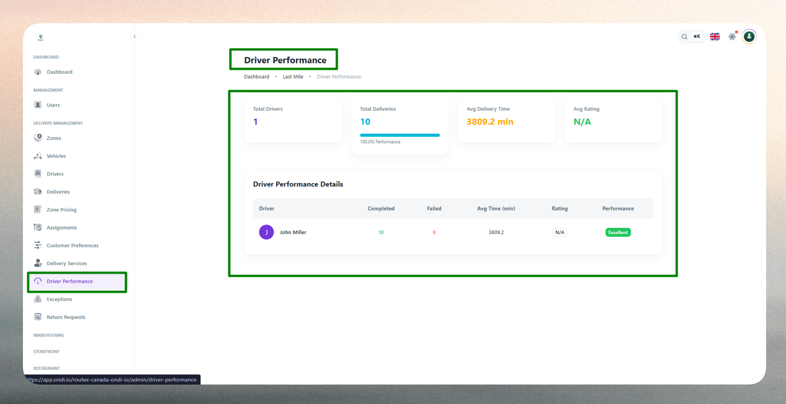

# Driver Performance

## What is Driver Performance?

Driver Performance represents a comprehensive evaluation system that measures and analyzes how effectively drivers execute deliveries within the logistics network. Each performance profile aggregates key metrics including delivery completion rates, average delivery times, failure rates, and customer feedback ratings to create a holistic view of driver effectiveness and service quality.

The system tracks performance continuously, enabling administrators and operations managers to identify top performers, recognize operational excellence, and address areas requiring improvement or training.

## Driver Performance Dashboard

The Driver Performance Dashboard provides a centralized view of delivery quality and efficiency across your driver network.

The dashboard displays aggregated performance metrics and individual driver statistics, allowing operations teams to evaluate service levels, compare driver outcomes, and make data-driven decisions about resource allocation and training needs. The interface includes:

- **Performance overview**: High-level KPIs showing total active drivers, completed deliveries, average delivery time, and overall customer ratings across the selected time period.
- **Filtering capabilities**: Filter performance data by time range (preset or custom), specific zones or hubs, individual drivers, or delivery type to focus on relevant segments.
- **Sorting options**: Sort driver performance by completion rates, average time, customer ratings, or overall performance score for quick identification of trends.
- **Export functionality**: Export performance reports to CSV for audits, performance reviews, incentive calculations, or management reporting.

The dashboard automatically refreshes based on selected filters, providing real-time insights into driver performance patterns and operational efficiency.

## Performance Metrics

The system tracks and displays several key performance indicators to evaluate driver effectiveness:

### Aggregate Metrics

- **Total Drivers**: Number of active drivers included in the current performance analysis.
- **Total Deliveries**: Cumulative count of completed deliveries within the selected timeframe.
- **Average Delivery Time**: Mean time taken by drivers to complete deliveries from assignment to completion.
- **Average Rating**: Overall customer satisfaction score based on feedback and service ratings.

### Individual Driver Metrics

Each driver's performance profile includes detailed statistics displayed in the performance table:

- **Completed Deliveries**: Total number of successful deliveries executed by the driver.
- **Failed Deliveries**: Count of deliveries marked as failed, returned, or undeliverable.
- **Average Delivery Time**: Mean duration per delivery for the individual driver.
- **Customer Rating**: Average feedback score from customers served by the driver.
- **Overall Performance Score**: Composite evaluation (e.g., Excellent, Good, Needs Improvement) based on weighted performance criteria.

These metrics provide both high-level visibility and granular detail for comprehensive performance assessment.

## How Performance is Tracked

The system calculates driver performance using multiple data points collected throughout the delivery lifecycle.

Performance scoring combines quantitative metrics (delivery counts, completion times, failure rates) with qualitative feedback (customer ratings, service quality indicators). The system aggregates data from completed delivery records, timestamps from driver app interactions, customer feedback submissions, and exception reports to generate comprehensive performance profiles.

**Evaluation Criteria**:

- **Efficiency**: Measured by average delivery time compared to expected delivery windows and benchmarks.
- **Reliability**: Calculated from the ratio of completed deliveries to total assigned deliveries.
- **Quality**: Derived from customer ratings, feedback scores, and service compliance indicators.
- **Consistency**: Assessed through performance variance over time and across different delivery conditions.

The overall performance score applies weighted calculations to these criteria, providing a balanced assessment that reflects both productivity and service quality. Administrators can customize weighting factors and evaluation thresholds based on operational priorities and business requirements.

## Performance Analysis and Insights

The performance data enables several analytical capabilities for operational improvement:

**Trend Identification**: Time-series analysis reveals patterns in delivery times, failure rates, and customer satisfaction, helping identify seasonal variations, training needs, or systemic issues.

**Comparative Analysis**: Side-by-side driver comparisons highlight performance differentials, enabling fair evaluation and targeted coaching for underperforming drivers while recognizing top contributors.

**Zone and Route Optimization**: Performance metrics segmented by zone or delivery type reveal geographic or operational factors affecting efficiency, supporting route optimization and resource reallocation.

**Workload Balancing**: Delivery volume and timing data help operations teams distribute assignments equitably, preventing driver burnout and maintaining consistent service levels.

Operations teams can drill down into individual driver records to review detailed delivery histories, identify specific performance issues, and track improvement over time following coaching or training interventions.

::::note
Performance metrics reflect system-recorded data only. Ensure drivers consistently use the mobile app to log delivery events for accurate performance tracking.
::::

::::tip
Review performance data regularly (weekly or monthly) to identify emerging trends before they impact service quality. Export reports to support performance reviews, incentive programs, and driver recognition initiatives.
::::

::::info
Save frequently used filter combinations as custom views to quickly regenerate performance reports for specific zones, time periods, or driver groups.
::::
