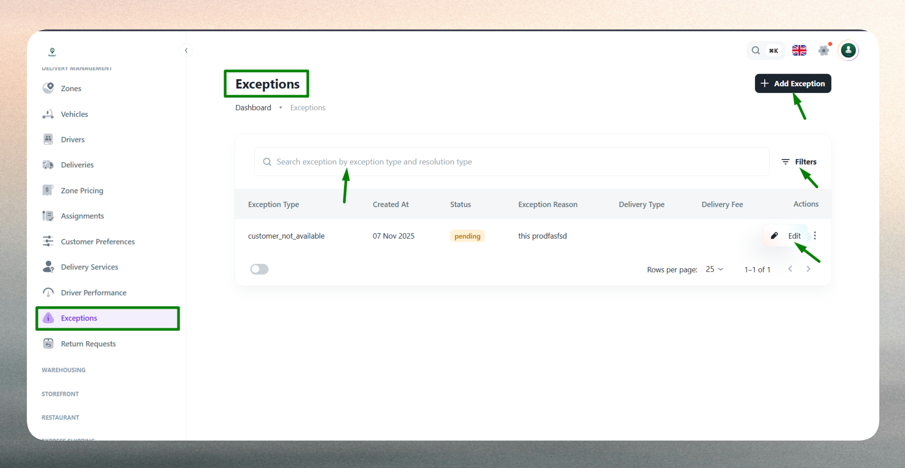
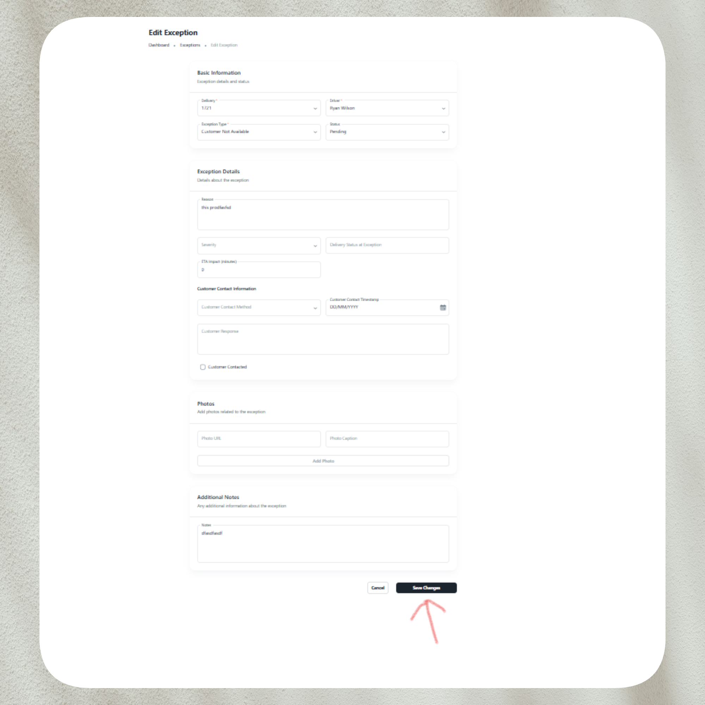

# Exceptions

## What is an Exception?

An exception represents any issue that prevents a delivery from being completed successfully or as planned. Each exception record captures the nature of the problem, identifies involved parties (delivery, driver, customer), documents supporting evidence, and tracks the resolution process from incident to closure. Exceptions enable operations teams to maintain visibility over delivery problems, identify recurring issues, and ensure accountability throughout the logistics workflow.

Typical issues logged as exceptions include failed deliveries, damaged packages, customer unavailability, incorrect addresses, access restrictions, or service delays. Each exception is categorized by type, assigned a resolution status (Pending, Resolved, or Closed), and linked to the specific delivery and driver involved. Supporting details such as photos, customer contact information, and operational notes provide context for investigation and enable timely resolution.

## Exception List

The Exception List provides a comprehensive view of all logged issues across delivery operations, helping managers monitor problems, track resolution progress, and identify patterns that require operational improvements.

Use the list to review active issues, verify resolution status, and analyze exception trends. The interface includes:

- **Search functionality**: Quickly locate exceptions by delivery code, driver name, or customer details.
- **Filtering options**: Filter exceptions by status (Pending, Resolved, Closed), exception type, date range, driver, or delivery service.
- **Sorting capabilities**: Sort by logged date, status, exception type, or delivery code.
- **Quick actions**: Access exception details, update status, or mark issues as resolved directly from the list.

The list displays key information such as associated delivery code, driver name, exception type, current status, logged date and time, and available actions for easy reference and operational control.

Exceptions progress through a resolution lifecycle: Pending (issue logged, awaiting action), Resolved (corrective action taken), and Closed (issue fully addressed and archived). This status tracking enables operations teams to prioritize urgent issues, measure resolution times, and maintain service quality standards.

## Create a New Exception

Creating an exception requires logging key information to document the issue and support effective resolution.

Exceptions are typically created when delivery problems occur that require operational intervention, documentation, or customer communication. Common scenarios include delivery failures, package damage discovered during pickup or transit, customer unavailability after multiple attempts, address errors that prevent delivery completion, or vehicle breakdowns affecting service fulfillment.

### Delivery & Driver Information

Link the exception to the specific delivery order where the issue occurred to ensure accurate tracking and reporting. Select the driver assigned to that delivery to identify responsibility, support performance analysis, and enable targeted follow-up. These associations allow the system to maintain complete audit trails and generate meaningful reports on exception patterns by delivery type, driver, or route.

### Exception Classification

Select the exception type from predefined categories such as Failed Delivery, Package Damaged, Customer Not Available, Incorrect Address, Access Denied, or Vehicle Issue. Accurate categorization helps operations teams identify recurring problems, track issue frequency by type, and implement targeted process improvements. Choose the current resolution status (Pending for new issues, Resolved if corrective action has been taken, or Closed if fully addressed). Provide a clear, concise description of the issue including relevant circumstances, observations, and any immediate actions taken.

### Customer & Contact Details

Select the customer associated with the affected delivery and include contact information (phone and email) to enable direct communication for resolution coordination, appointment rescheduling, or service recovery. Accurate customer information ensures timely outreach, reduces resolution time, and helps maintain customer satisfaction despite delivery problems.

### Supporting Evidence & Notes

Attach photo evidence by uploading images or providing URLs to visual documentation such as damaged packages, access restrictions, incorrect address labels, or delivery location conditions. Visual proof strengthens claim verification, supports insurance processes, and provides transparency for customer communication. Add operational notes to record follow-up actions, escalation details, root cause analysis, or resolution steps taken. Detailed notes create an auditable record for internal reviews and future process improvements.

### Validation

The system validates all required fields and enforces business rules. Delivery and driver selections are mandatory to ensure proper tracking. Exception type and status must be valid selections from predefined options. Photo URLs (if provided) must be properly formatted links. Customer contact details must meet formatting requirements. Duplicate exceptions for the same delivery and exception type are prevented to avoid redundant records. Any validation errors are highlighted for correction before submission.

## Edit or Resolve an Exception

Exception records can be updated to reflect investigation progress, resolution actions, or status changes as issues move through their lifecycle.

Common updates include:

- **Status progression**: Update exception status from Pending to Resolved as corrective actions are completed, or to Closed when issues are fully addressed and archived. Status changes provide visibility into resolution progress and help operations teams prioritize active issues.
- **Resolution details**: Add notes documenting investigation findings, corrective actions taken, customer communication, or preventive measures implemented to avoid recurrence.
- **Contact updates**: Modify customer phone numbers or email addresses to reflect corrected information or updated contact preferences.
- **Evidence additions**: Upload additional photos or documentation to support claims processing, insurance verification, or customer service resolution.
- **Exception reclassification**: Correct exception type if initial categorization was inaccurate or if issue investigation reveals a different root cause.
- **Customer communication logs**: Record details of customer outreach, resolution agreements, refund processing, or service recovery actions taken.

Updating exception records ensures accurate tracking, maintains complete audit trails, and enables meaningful reporting on exception trends, resolution times, and operational performance. Regular exception review and timely status updates help operations teams identify systemic issues, implement process improvements, and maintain high service quality standards.

::::note
Log exceptions promptly when issues occur to ensure accurate documentation and enable timely resolution. Review the exception list regularly to identify recurring problems and operational bottlenecks.
::::

::::tip
Attach photo evidence whenever possible to strengthen claims verification and accelerate resolution. Use clear, specific descriptions that include relevant context for faster investigation and corrective action.
::::

::::info
Track resolution times and exception patterns to identify training needs, process improvements, or infrastructure issues requiring attention. Communicate resolution updates to customers proactively to maintain trust and service quality perception.
::::

