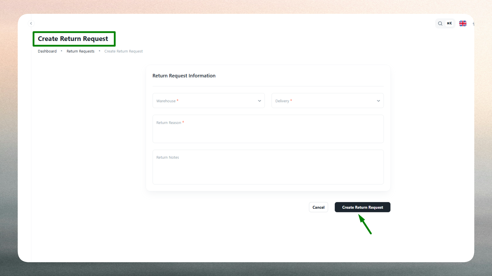

# Return Requests

## What is a Return Request?

A Return Request represents an item or shipment that must be sent back to a warehouse after delivery or during the delivery process. Each return request captures the associated delivery, handling warehouse, return reason, resolution status, and relevant operational notes. Return requests enable organizations to systematically manage reverse logistics, maintain inventory accuracy, and track the complete lifecycle of returned goods from initiation to completion.

Typical scenarios for creating return requests include customer-initiated returns (wrong item delivered, damaged goods, or order cancellation), quality issues identified after delivery, failed delivery attempts requiring package retrieval, or operational returns triggered by warehouse inventory corrections. Each return is linked to the original delivery for full traceability, assigned to a specific warehouse for processing, and categorized by reason to enable trend analysis and process improvements.

Return requests progress through defined status stages—Pending (request created awaiting action), In Transit (package being returned to warehouse), Received (warehouse has taken possession), and Completed (return fully processed and resolved). This status tracking provides visibility into return workflows, supports SLA monitoring, and ensures accountability throughout the reverse logistics process.

## Return Request List

The Return Request List provides a comprehensive view of all return cases logged in the system, enabling warehouse teams and operations managers to monitor return volumes, track resolution progress, and analyze return patterns.

Use the list to review active returns, verify processing status, and identify trends requiring attention. The interface includes:

- **Search functionality**: Quickly locate return requests by delivery code, warehouse name, or customer reference.
- **Filtering options**: Filter returns by status (Pending, In Transit, Received, Completed), return reason, date range, warehouse, or processing staff.
- **Sorting capabilities**: Sort by creation date, status, warehouse, or return reason.
- **Quick actions**: Access return details, update status, or view associated delivery information directly from the list.

The list displays key information such as linked delivery code, assigned warehouse, return reason category, current status, processing staff member, and creation timestamp for easy reference and operational control.

Return requests move through a resolution lifecycle that reflects the physical and administrative progression of returned goods. Pending status indicates a newly logged return awaiting warehouse confirmation or customer shipment. In Transit reflects returns actively being transported back to the warehouse facility. Received marks returns that have arrived at the warehouse and are awaiting inspection or restocking. Completed status indicates returns that have been fully processed, inspected, and resolved through inventory adjustments, refunds, or disposals. This status progression enables teams to prioritize urgent returns, measure processing times, and maintain service quality standards.

## Create a New Return Request

Creating a return request requires documenting key information to ensure proper routing, processing, and resolution of returned goods.

Return requests are typically created when customers report dissatisfaction with delivered items, when quality issues are identified post-delivery, when delivery attempts fail and packages require retrieval, or when inventory discrepancies necessitate product returns. Common return scenarios include damaged items discovered upon customer receipt, incorrect products shipped due to fulfillment errors, customer order cancellations after dispatch, quality defects requiring replacement or refund, or access failures preventing successful delivery completion.

### Warehouse & Delivery Linking

Select the warehouse responsible for receiving and processing the returned goods. Warehouse assignment determines which facility will handle inspection, restocking, or disposal operations, and ensures return routing aligns with inventory management protocols. Link the return request to the specific delivery order that originated the shipment. This association maintains complete traceability between outbound deliveries and inbound returns, supports accurate inventory reconciliation, and enables analytics on return rates by delivery type, customer, or product category.

### Return Classification

Select the return reason from predefined categories such as Damaged Item, Wrong Product Delivered, Customer Cancelled Order, Quality Issue, Failed Delivery Attempt, or Address Error. Accurate categorization enables operations teams to identify recurring problems, track issue frequency by type, and implement targeted process improvements in fulfillment accuracy, packaging quality, or delivery execution. Choose the current resolution status (Pending for newly logged returns, In Transit if the customer or driver has initiated return shipment, Received if the warehouse has confirmed possession, or Completed if processing is finalized). Provide operational notes to capture customer comments, handling instructions, special processing requirements, or context supporting investigation and resolution.

### Validation

The system validates all required fields and enforces business rules. Warehouse and delivery selections are mandatory to ensure proper tracking and routing. Return reason and status must be valid selections from predefined options to maintain data consistency. Notes are optional but recommended for clarity and audit purposes. Duplicate return requests for the same delivery are prevented to avoid redundant processing and inventory conflicts. Any validation errors are highlighted for correction before submission.

## Edit or Approve Return Request

Return request records can be updated to reflect processing progress, resolution actions, or status changes as returns move through their reverse logistics lifecycle.

Common updates include:

- **Status progression**: Update return status from Pending to In Transit as the customer or driver initiates return shipment, to Received when the warehouse confirms physical possession, or to Completed when processing is finalized through restocking, refund issuance, or disposal. Status updates provide visibility into processing progress and help teams prioritize active returns requiring attention.
- **Resolution documentation**: Add notes documenting inspection findings, quality assessments, restocking decisions, refund processing, customer communication, or root cause analysis supporting process improvements.
- **Return reason corrections**: Modify return reason classification if initial categorization was inaccurate or if warehouse inspection reveals a different underlying issue than originally reported.
- **Warehouse reassignment**: Update assigned warehouse if logistics considerations, capacity constraints, or operational changes require rerouting the return to a different facility.
- **Processing assignments**: Record which staff member or team is handling the return to establish accountability and enable workload tracking.
- **Approval workflows**: Mark returns as approved or authorized based on organizational policies requiring management review before refund processing or inventory adjustments.

Updating return request records ensures accurate tracking, maintains complete audit trails for compliance and reporting, and enables meaningful analytics on return volumes, resolution times, and operational performance. Regular return review and timely status updates help organizations identify systemic quality issues, optimize reverse logistics processes, reduce return rates through root cause elimination, and maintain customer satisfaction through responsive resolution handling.

::::note
Log return requests promptly when issues are reported to ensure timely processing and accurate inventory tracking. Monitor return volumes and reasons regularly to identify quality trends or fulfillment problems requiring corrective action.
::::

::::tip
Use clear, specific return reasons and detailed notes to support efficient warehouse processing and meaningful trend analysis. Link returns to correct delivery records to maintain traceability and enable accurate performance reporting.
::::

::::info
Track return resolution times and reason patterns to identify training needs, quality improvements, or supplier issues requiring attention. Communicate return status updates to customers proactively to maintain trust and service quality perception.
::::
