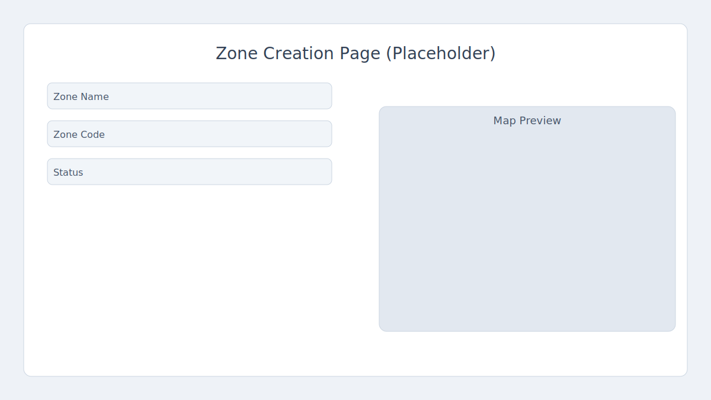
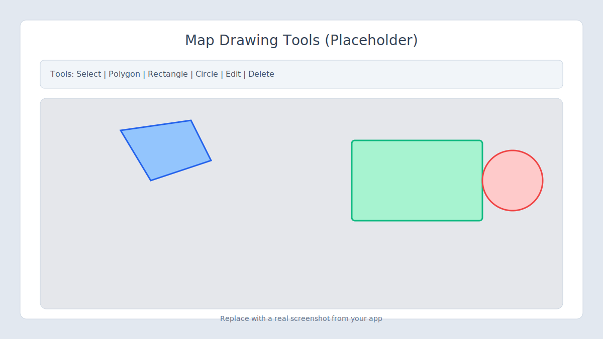
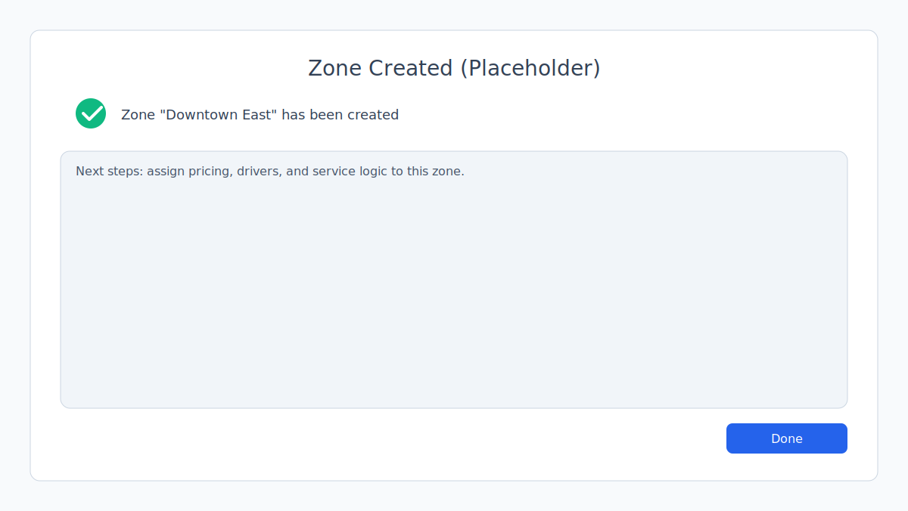

# Zones

Zones let you define serviceable areas on a map and attach business logic like pricing, density rules, and whether deliveries are handled internally or by external carriers.

## What is a Zone?

- A zone is a geographic region you draw on the map to represent your serviceable area.
- Zones enable you to:
  - Assign services and drivers to that area
  - Set pricing and other business rules
  - Control whether deliveries are managed internally or handed off to third‑party carriers (external)

Zones help define which parts of a city or region your logistics system supports for deliveries.

## Create a Zone

Follow these steps to add a new zone.

### 1) Navigate to Zone Creation

Go to the Delivery Management module in your admin portal. Select "Zones", then click "Create Zone".

### 2) Fill Basic Zone Details

- **Zone Name**: Enter a clear name that identifies this area logically. This name is shown throughout delivery management for selection and reporting.
- **Zone Code**: Enter a unique code (no spaces or unauthorized characters). Every zone must have a distinct code—the system checks for uniqueness and invalid input. Codes help automate settings and reduce errors later.

### 3) Set Zone Status

- **Status (Active/Inactive)**: Only Active zones are used by the system for service, pricing, and assignment. Keep a zone Inactive if you are still planning your serviceable areas and don’t want them published yet.

### 4) Population Density

Select how busy this area typically is (**Low**, **Medium**, **High**). This may affect route planning, driver assignment, and pricing logic inside your delivery system.

### 5) Internal or External Delivery Handling

- **Internal Enabled**: If checked, your own drivers or fleet will handle deliveries within this zone.
- **External Integration Enabled**: If checked, this zone can send orders to third‑party carriers for delivery (details about carriers are covered in the Carriers documentation).

### 6) Draw Your Zone on the Map

Use map tools like Draw Polygon, Rectangle, or Circle to mark the exact boundaries. Choose the shape that best fits your service area. You can zoom, pan, and adjust your drawing until it matches your needs.

### 7) Review & Confirm

Double‑check all details, code, and map boundaries. Click **Create Zone** to submit. If any required fields are missing or if your code is not unique/valid, the system will show an error. Fix incorrect entries and submit again.

Once created, your zone appears in the list for assigning pricing, drivers, and service logic.

## Notes

:::note
Inactive zones are ignored by the system—use this to draft or plan without making zones live.
:::

:::tip
The density setting can help estimate workload and optimize driver routes.
:::

:::info
For external deliveries, see the Carriers documentation for integration details.
:::
