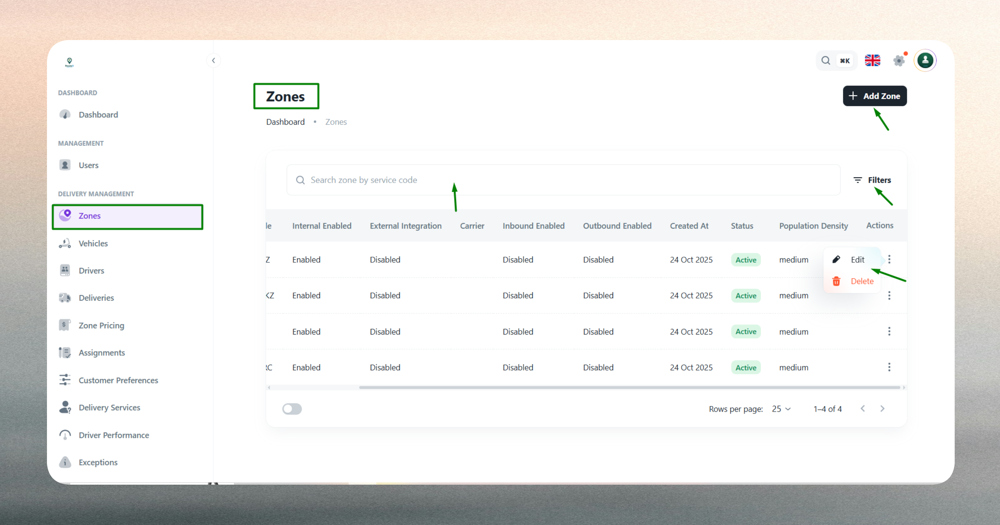
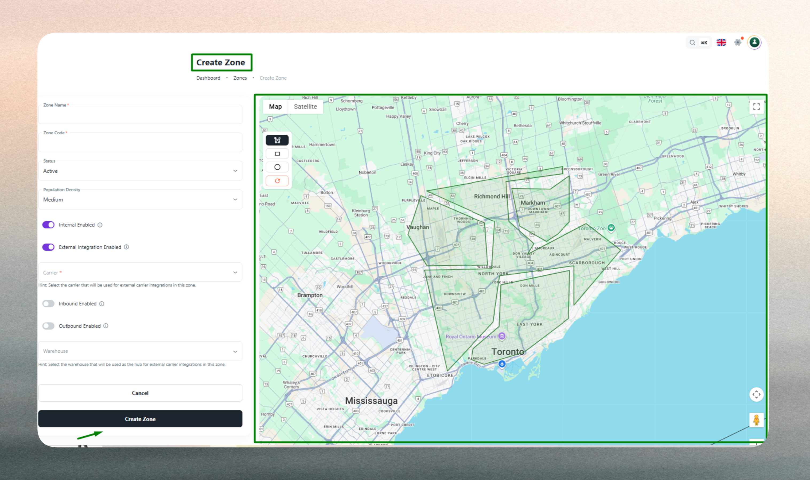
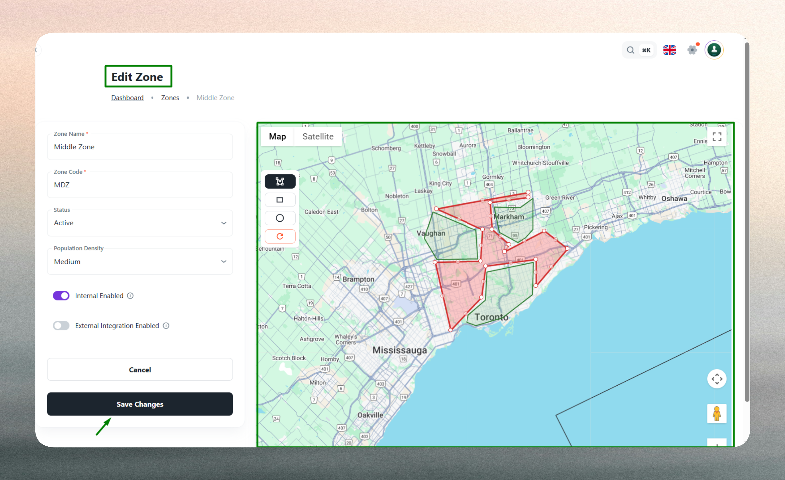

# Zones

Zones let you define serviceable areas on a map and attach business logic like pricing, density rules, and whether deliveries are handled internally or by external carriers.

## What is a Zone?

A zone is a geographic region that represents a serviceable area within your delivery network. Zones serve as the foundation for organizing delivery operations by establishing clear boundaries where your logistics system operates.

Zones enable you to:

- **Geographic Segmentation**: Define precise service boundaries that determine where deliveries can be fulfilled
- **Operational Control**: Assign drivers, services, and delivery resources to specific geographic areas
- **Business Rule Application**: Attach pricing models, density classifications, and delivery handling methods to distinct regions
- **Delivery Routing**: Control whether deliveries within a zone are handled by your internal fleet or routed to external carrier partners

Zones help define which parts of a city or region your logistics system supports for deliveries, enabling scalable and organized delivery management across diverse geographic areas.

## Zone List

The zone list provides a centralized view of all configured zones in your delivery system. Each zone entry displays key operational attributes including name, code, status, density classification, and delivery handling configuration.
 

The list enables quick identification of active service areas, inactive planning zones, and zones configured for internal versus external delivery handling. This overview supports operational decision-making by providing visibility into your geographic service coverage and zone-level configurations.

## Create a Zone

When creating a zone, you define its identity, operational characteristics, and geographic boundaries. Each configuration element serves a specific purpose in delivery operations.

### Zone Name

The zone name is a human-readable identifier that appears throughout the delivery management system for selection, reporting, and operational workflows. This name should clearly represent the geographic area or service region it covers, as it will be used by dispatchers, drivers, and administrators when referencing the zone in daily operations.

Zone names are displayed in assignment interfaces, delivery reports, and zone selection dropdowns, making clear and consistent naming essential for operational efficiency.

### Zone Code

The zone code is a unique alphanumeric identifier that serves as the system's technical reference for the zone. Every zone must have a distinct code that follows specific formatting rules: no spaces or unauthorized characters are permitted.

The system enforces code uniqueness across all zones, preventing conflicts in automated processes and integrations. Zone codes enable programmatic zone identification in APIs, automated routing logic, and system integrations where human-readable names are less reliable.

### Status

Zone status determines whether a zone is operational within the delivery system. **Active** zones are included in service area calculations, pricing evaluations, driver assignments, and delivery routing decisions. **Inactive** zones are excluded from all operational processes, allowing you to draft, plan, or temporarily disable zones without deleting them.

Setting a zone to Inactive effectively removes it from service consideration while preserving its configuration for future activation. This is useful for planning new service areas, temporarily suspending service in specific regions, or testing zone configurations before making them live.

### Population Density

Population density classification indicates the expected delivery volume and operational complexity within a zone. The system supports three classifications: **Low**, **Medium**, and **High**.

This setting influences route optimization algorithms, driver assignment logic, and capacity planning. High-density zones may trigger different routing strategies, require more driver resources, or apply different pricing models compared to low-density areas. The density classification helps the system make informed decisions about resource allocation and delivery scheduling.

### Internal vs External Delivery Handling

Zones can be configured to support internal delivery handling, external carrier integration, or both simultaneously.

**Internal Enabled**: When enabled, deliveries within this zone can be assigned to your own drivers and fleet. Internal handling provides direct control over delivery operations, customer experience, and delivery timelines. This is typically used for zones where you have sufficient driver coverage and want to maintain operational control.

**External Integration Enabled**: When enabled, deliveries within this zone can be routed to third-party carrier partners for fulfillment. External handling extends your service coverage to areas where maintaining your own fleet may not be cost-effective or operationally feasible. The system can automatically route orders to configured carrier integrations based on zone settings and carrier availability.

A zone can have both options enabled, allowing the system to choose between internal and external handling based on capacity, availability, or business rules. This flexibility supports hybrid delivery models where some zones are primarily internal while others rely on external partners.

### Map Boundary Definition

Zone boundaries are defined using geographic drawing tools that support polygon, rectangle, and circle shapes. The selected boundary shape determines the precise geographic area where the zone's rules and configurations apply.

The boundary definition is critical because it directly impacts:
- **Service Area Validation**: Whether a delivery address falls within a zone's boundaries determines which zone's rules apply
- **Driver Assignment**: Drivers assigned to a zone are responsible for deliveries within its boundaries
- **Pricing Application**: Zone-based pricing rules apply to deliveries within the defined boundaries
- **Carrier Routing**: External carrier integrations use zone boundaries to determine routing eligibility

The system validates that boundaries form valid geographic shapes and that zones do not create conflicting service area definitions where appropriate.

### Validation Rules

The system enforces several validation rules during zone creation:

- **Zone Code Uniqueness**: Each zone code must be unique across the entire system. Duplicate codes are rejected to prevent conflicts in automated processes.
- **Required Fields**: Zone name and zone code are mandatory. Missing required fields prevent zone creation.
- **Code Format**: Zone codes must conform to allowed character sets and cannot contain spaces or unauthorized special characters.
- **Boundary Validity**: Geographic boundaries must form valid shapes. Invalid or incomplete boundary definitions are rejected.
- **Status Consistency**: Zone status must be explicitly set to either Active or Inactive.

Validation errors are surfaced when these rules are violated, requiring corrections before the zone can be created.

## Edit a Zone

Zone editing allows you to modify all zone attributes after initial creation. Changes to zone configurations immediately affect operational behavior for active zones.

### Modifiable Attributes

All zone attributes can be edited: name, code, status, population density, internal/external handling settings, and geographic boundaries. Changes to active zones take effect immediately and may impact ongoing delivery operations.

### Zone Code Changes

Changing a zone code requires careful consideration because the code serves as a technical identifier in integrations and automated processes. Code changes may require updates to external systems or integrations that reference the zone by code. The system enforces the same uniqueness and format rules during editing as during creation.

### Status Changes

Activating an inactive zone immediately makes it available for service assignments, pricing calculations, and delivery routing. Deactivating an active zone removes it from operational consideration, which may affect delivery assignments and service area coverage.

### Boundary Modifications

Updating zone boundaries changes the geographic area where the zone's rules apply. Boundary modifications can expand or contract service areas, potentially affecting existing delivery assignments, pricing applications, and service coverage. The system validates boundary changes using the same rules as initial creation.

### Operational Impact

Edits to active zones can have immediate operational consequences. Changes to boundaries may move addresses in or out of a zone, affecting which pricing rules and delivery methods apply. Status changes can enable or disable entire service areas. Internal/external handling modifications can shift delivery routing between your fleet and carrier partners.

Consider the operational impact of zone edits, especially for zones currently handling active deliveries or integrated with external systems.
