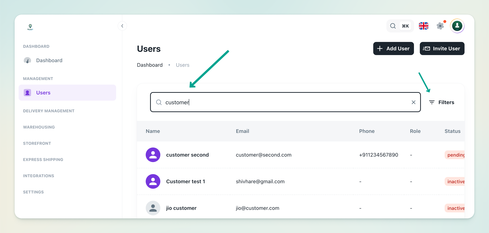
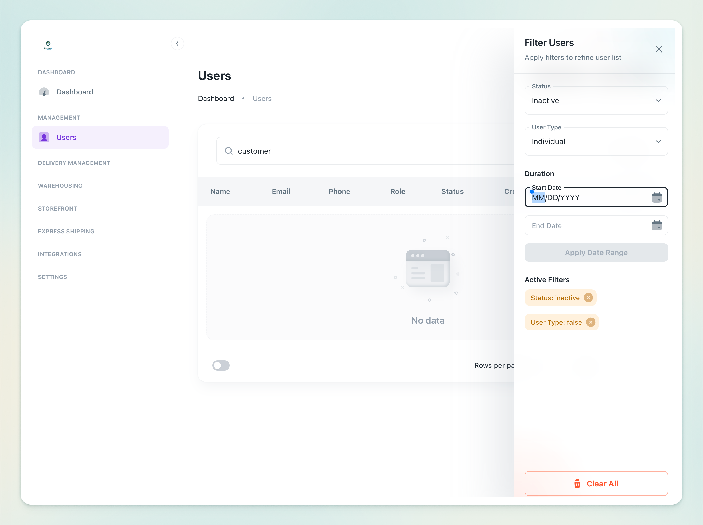

# Exploring the Users List

When you navigate to Management → Users, you’re presented with the user list for your tenant. The table shows each user’s name, email, phone, role, status, and creation date. You can scroll through the list or use search and filters to find specific entries.

**Search bar**: At the top of the list is a search box where you can enter a user’s name, email or phone number to quickly narrow down the list.

**Filters**: Next to the search bar, there is a Filters button. Clicking it opens a panel where you can filter users by status (Active, Inactive, Pending) and date range. Use this to refine the list. After you apply filters, only users meeting your criteria will be displayed.

**Actions column**: Each row in the table has an Actions menu where you can perform user‑specific tasks (e.g., edit, deactivate).
