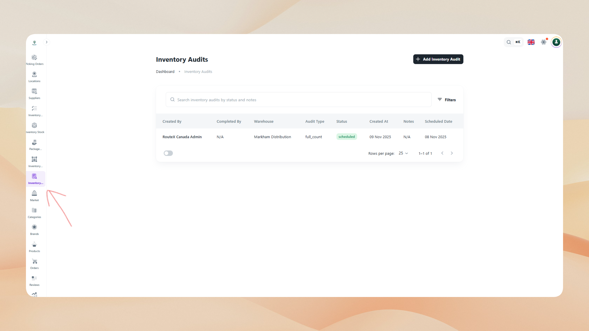
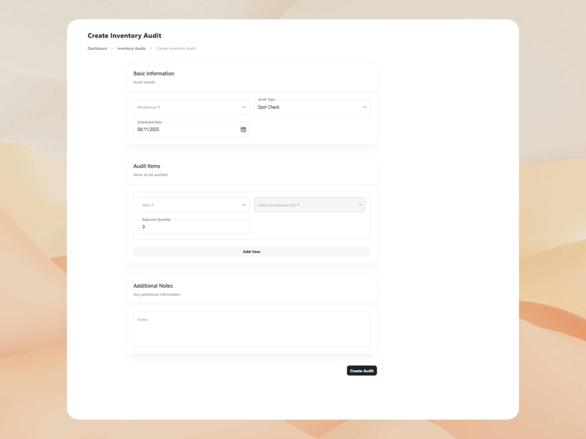

# Inventory Audits

The Inventory Audits module enables administrators and warehouse managers to verify that physically counted stock matches system-recorded quantities. Audits ensure data accuracy, detect discrepancies early, and maintain trust in inventory records across receiving, fulfillment, and reporting workflows.

## What is an Inventory Audit?

An inventory audit represents a systematic verification process that compares physical stock counts against system-recorded quantities for specific items and locations. Each audit captures the warehouse, audit type (Full Audit, Cycle Count, or Spot Check), items to be verified, and the personnel responsible for conducting the count.

Inventory audits enable:

- **Inventory accuracy**: Validate that system records reflect actual physical stock on hand.
- **Discrepancy detection**: Identify missing items, bin misallocations, or quantity mismatches early.
- **Compliance and accountability**: Track when audits occur, who performed them, and what variances were found.
- **Process improvement**: Detect patterns in discrepancies to identify training needs, workflow issues, or system integration problems.
- **Reconciliation support**: Provide documented evidence for financial reconciliation and regulatory compliance.

Audits are typically scheduled based on business needs—high-movement SKUs may undergo frequent cycle counts, while full warehouse audits occur quarterly or annually. Spot checks address specific concerns or follow up on reported discrepancies.

## Inventory Audit List

The Inventory Audit List displays all audit records across warehouses, providing visibility into verification activities, outcomes, and current status.

 

Use the list to monitor audit completion, review variance results, and identify items requiring attention. The interface includes:

- **Search functionality**: Quickly locate audits by warehouse, audit ID, audit type, or performer.
- **Filtering options**: Filter by warehouse, audit type (Full, Cycle, Spot), status (Draft, In Progress, Completed), or date range.
- **Sorting capabilities**: Sort by audit date, warehouse, status, or performer for organized review.
- **Quick actions**: Access audit details, view variance reports, or edit in-progress audits directly from the list.

The list displays key information such as audit ID, warehouse, audit type, creation date, status, performed by, and variance summary. This centralized view supports accountability, audit planning, and historical analysis of inventory verification activities.

## Create a New Inventory Audit

Creating an inventory audit establishes the scope, timing, and items to be verified during the physical count process.

 

### Audit Scope and Frequency

Administrators define the audit type based on operational needs and inventory control strategy. Full Audits verify all items in a warehouse and are typically performed quarterly, annually, or before major reconciliations. Cycle Counts focus on specific high-movement or high-value items and occur regularly (weekly or monthly) to maintain ongoing accuracy. Spot Checks address ad-hoc concerns, investigate reported discrepancies, or verify specific bins or SKUs when issues arise.

### Audit Details

When creating an audit, administrators specify the warehouse where the count will occur, ensuring that the verification is tied to a specific facility. The audit type determines whether all items or a selected subset will be counted. For Cycle Counts and Spot Checks, specific items must be selected based on movement patterns, value thresholds, or known discrepancy risks.

### Data Verified

Each audit captures both system quantities and physical counts for comparison. The system quantity represents the current stock level recorded in the system at the time of the audit. Physical quantity is entered by the personnel conducting the count, reflecting actual on-hand stock. The variance is automatically calculated (Physical − System) to highlight discrepancies requiring investigation or adjustment.

Optional fields include remarks or notes that provide context about the audit purpose, special conditions, or preliminary observations. The created by field is auto-captured to ensure accountability and traceability for reporting and compliance purposes.

### Audit Items

For targeted audits, administrators select the specific items to verify. Each audit item includes the warehouse (auto-filled from the audit header), the item or SKU being counted, the current system quantity for reference, and a field to record the physical quantity during the count. Variances are calculated automatically and displayed for immediate visibility into discrepancies.

:::note
Conduct cycle counts regularly for high-movement items to maintain ongoing accuracy and reduce the need for disruptive full warehouse audits. Use two-person verification for high-value or sensitive stock.
:::

:::tip
Count by bin location rather than by item to reduce double counting and improve traceability. Schedule audits during low-activity periods to minimize operational disruption and ensure accurate counts.
:::

:::info
Completed audits are read-only and preserved for audit trail purposes. Any inventory corrections resulting from audits should be applied through Inventory Stock adjustments or Inventory Transactions with clear references to the audit ID.
:::