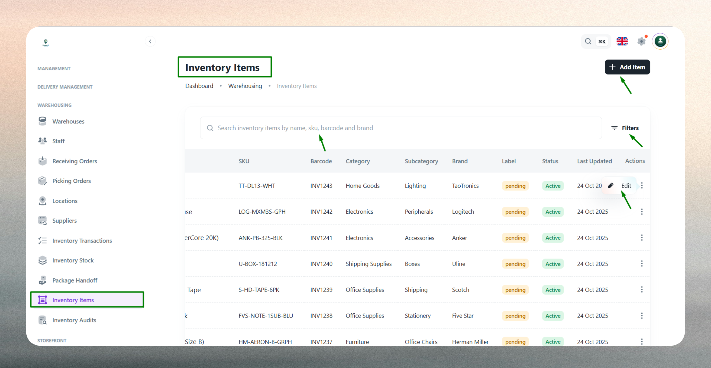
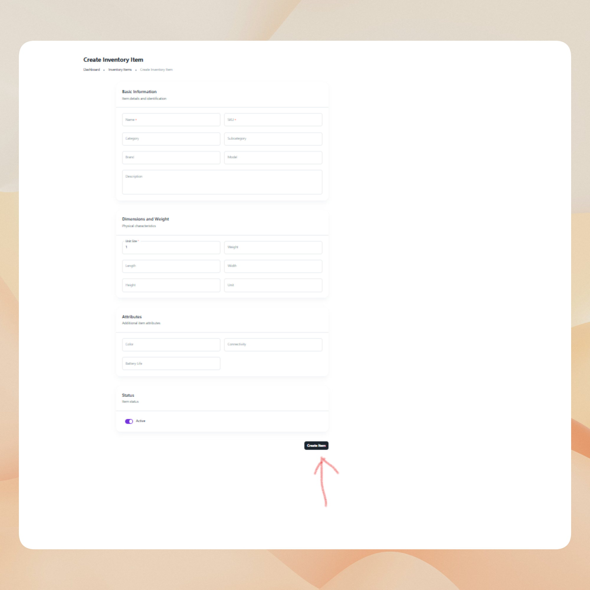
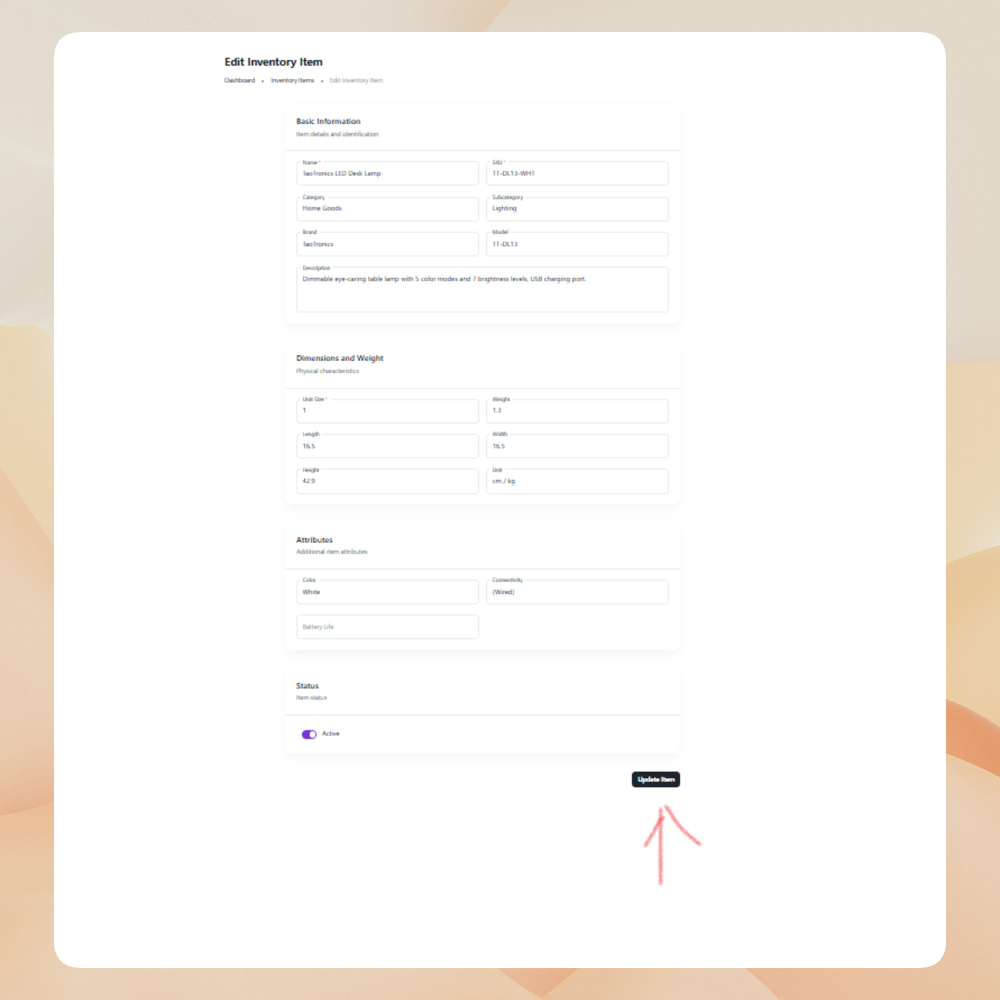

# Inventory Items

The Inventory Items module enables administrators to maintain a comprehensive master catalog of all products managed within the warehouse and logistics system. Each inventory item serves as a reference point for stock tracking, receiving operations, order fulfillment, and reporting across the organization.

## What are Inventory Items?

An inventory item represents a product record in the system's master catalog. Each item profile includes essential identifiers such as SKU, barcode, category classification, brand, model, and physical specifications. Inventory items form the foundation for all warehouse operations, enabling:

- **Stock management**: Track quantities, locations, and movements of products across warehouses and bin locations.
- **Receiving operations**: Identify and verify incoming goods during receiving order processing.
- **Order fulfillment**: Support picking and packing activities with accurate product information.
- **Reporting and analytics**: Generate insights based on categories, brands, and product performance.
- **System integrations**: Enable seamless data exchange with external platforms using SKU and barcode identifiers.

Proper inventory item configuration ensures consistency and traceability across purchasing, receiving, stocking, picking, and delivery workflows. Each item record serves as a single source of truth for product data throughout the logistics process.

## Inventory Item List

The Inventory Item List provides a comprehensive view of all products registered in your master catalog.

Use the list to monitor item status, verify product details, and manage catalog accuracy. The interface includes:

- **Search functionality**: Quickly locate items by name, SKU, barcode, or brand.
- **Filtering options**: Filter by category, subcategory, brand, or status (Active/Inactive).
- **Sorting capabilities**: Sort by item name, SKU, category, or recent activity.
- **Quick actions**: Access item details, edit profiles, or change status directly from the list.

 

The list displays key information such as item name, SKU, barcode, category, subcategory, brand, status, and timestamps for easy reference. This centralized view supports catalog management, product audits, and operational planning across the organization.

## Create a New Inventory Item

Creating an inventory item profile requires entering key information across several categories to ensure accurate product identification and operational efficiency.

 

### Basic Identification

Provide the product's essential identifiers including a clear, descriptive item name (e.g., "Samsung Galaxy S23 - 128GB Black") and a unique SKU (Stock Keeping Unit) code. The SKU must be unique across your entire catalog and should follow your organization's naming conventions for internal tracking and system integrations. If applicable, enter a scannable barcode that links to the SKU for efficient warehouse scanning and verification.

### Classification

Define the product's position in your organizational taxonomy by selecting the appropriate category (e.g., Electronics, Furniture, Apparel) and subcategory (e.g., Smartphones, Office Chairs, Outerwear). Accurate classification supports clean reporting, efficient filtering, and organized catalog browsing. Optionally specify the brand name (e.g., Samsung, Dell, Nike) and model number to provide additional identification detail for service workflows and product differentiation.

### Physical Specifications

Record the product's physical attributes to support warehouse planning and storage optimization. Enter dimensions (length × width × height) and specify height separately if required for volumetric calculations or bin placement planning. Define the unit of measure (e.g., pieces, kilograms, boxes, liters) to establish how the product is counted and tracked throughout inventory operations.

### Additional Details

Provide a description field for additional notes, specifications, or characteristics that help identify or differentiate the product. This information supports customer service, quality control, and operational clarity across teams.

### Status & Validation

Set the item's availability status (Active or Inactive). Active items are available for receiving, stocking, and order fulfillment operations, while Inactive status excludes them from selection for discontinued or seasonal products.

The system validates all required fields and enforces business rules. Item name, SKU, category, and subcategory are mandatory. Duplicate SKUs are not allowed, and barcodes must be unique if entered. Any validation errors are highlighted for correction before submission.

## Edit an Existing Inventory Item

Inventory item profiles can be updated at any time to reflect changes in product details, classification, or operational status.

Common updates include:

- **Classification adjustments**: Refine category or subcategory assignments as your taxonomy evolves or product lines expand.
- **Barcode additions**: Add or update barcode information as products receive new labels or packaging.
- **Brand and model updates**: Correct or standardize naming conventions across the catalog.
- **Physical specification changes**: Update dimensions or unit of measure for accuracy in storage planning and reporting.
- **Description enhancements**: Add notes, specifications, or clarifications to support operations and customer service.
- **Status changes**: Toggle between Active and Inactive status for product lifecycle management, seasonal availability, or discontinuation.
- **SKU modifications**: Standardize SKU conventions (use caution as SKU changes may affect inventory transactions and integrations).

 
 
Editing inventory items ensures accurate stock tracking, maintains catalog integrity, and supports dynamic product management. The system retains historical data for reporting and auditing purposes, preserving traceability even as item details evolve.

:::note
Keep item details current—especially SKU, barcode, and category information—to maintain accurate inventory operations and prevent receiving or fulfillment errors.
:::

:::tip
Use consistent SKU and naming conventions (e.g., `ELEC-SMPH-001`, `FURN-CHAIR-025`) across products for easier management and integration. Record complete physical specifications to optimize bin allocation and warehouse storage planning.
:::

:::info
Mark items as Inactive instead of deleting them if they are discontinued or temporarily unavailable. This preserves historical transaction data and allows for easy reactivation when needed.
:::

