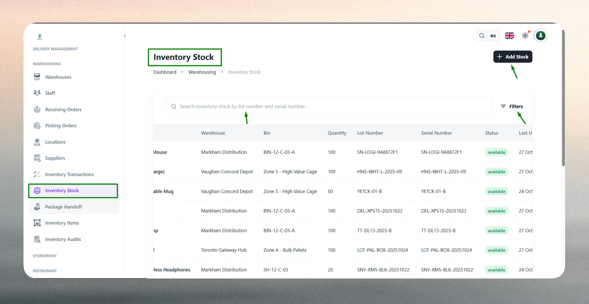
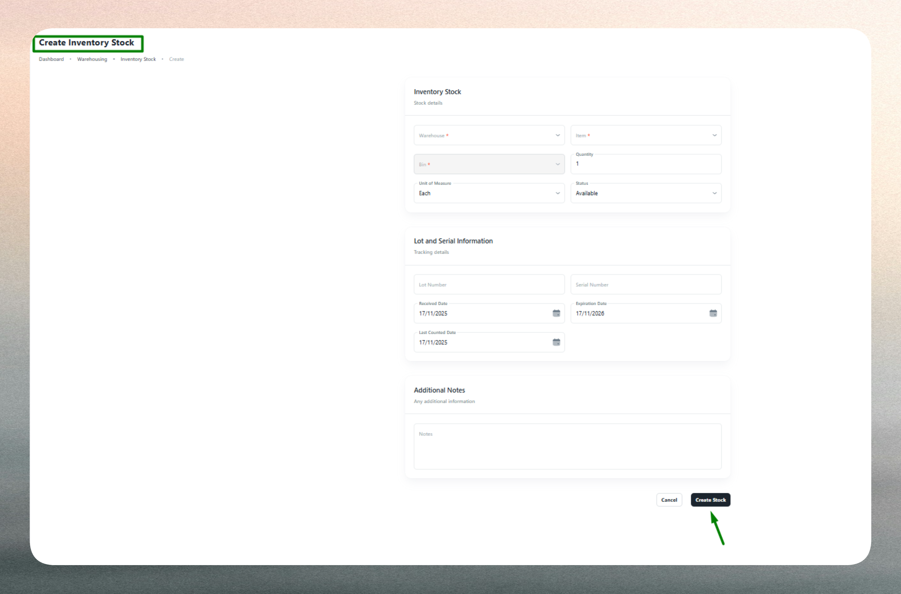

# Inventory Stock

The Inventory Stock module provides real-time visibility into all stock levels across warehouses, including precise bin locations, quantities, lot numbers, and serial tracking. Administrators can view current stock, make adjustments, and monitor inventory movement to ensure accurate control over warehouse data and product availability.

## What is Inventory Stock?

Inventory stock represents the current quantity of items physically available in specific warehouse locations. Each stock record includes the warehouse, item (SKU), bin location, available quantity, and optional lot or serial numbers for traceability. Stock records are primarily created and updated through operational workflows such as receiving orders, picking orders, and inventory transfers, but can also be manually adjusted when necessary.

Inventory stock tracking enables:

- **Real-time visibility**: Monitor current stock levels and locations across all warehouses.
- **Precise location tracking**: Identify exactly where items are stored within each facility down to the bin level.
- **Lot and serial traceability**: Track batch numbers and serial identifiers for compliance and quality control.
- **Inventory accuracy**: Maintain accurate stock counts through automated updates and manual adjustments.
- **Movement tracking**: Record when and by whom stock was created, modified, or moved.

Proper stock management ensures fulfillment accuracy, reduces picking errors, supports audit compliance, and provides transparency into inventory availability across the supply chain.

## Inventory Stock List

The Inventory Stock List displays all current stock records across warehouses, providing comprehensive visibility into item availability and locations.

 

Use the list to monitor stock levels, verify bin assignments, and identify discrepancies that may require adjustment. The interface includes:

- **Search functionality**: Quickly locate stock by item name, SKU, warehouse, bin location, lot number, or serial number.
- **Filtering options**: Filter stock by warehouse, specific items, bin locations, lot numbers, or date ranges to narrow down results.
- **Sorting capabilities**: Sort by warehouse, item, quantity, bin location, or last updated date for organized review.
- **Quick actions**: Access stock details, make adjustments, or view transaction history directly from the list.

The list displays key information such as warehouse name, item (SKU), bin location, available quantity, lot number (if applicable), serial number (if applicable), creation date, and last updated by user. This provides a complete snapshot of inventory distribution and enables quick identification of stock availability.

## Update or Adjust Stock

Stock adjustments allow administrators to manually correct inventory quantities when discrepancies arise or when recording non-operational stock changes.

  

Common reasons for stock adjustments include:

- **Physical count discrepancies**: Correct differences found during cycle counts or annual audits.
- **Damage or spoilage**: Reduce quantities for items that are damaged, expired, or unsellable.
- **Theft or loss**: Record missing inventory identified through investigations or audits.
- **System corrections**: Fix errors from incorrect data entry or system integration issues.
- **Initial stock loading**: Add opening balances when setting up a new warehouse or item.
- **Returns to vendor**: Adjust stock when defective items are returned to suppliers outside regular workflows.

### Making Adjustments

When adjusting stock, administrators specify the warehouse, item, and bin location being corrected, then enter the new quantity or adjustment amount. Optional lot and serial numbers can be included for batch-tracked or serialized items. Notes should be added to document the reason for adjustment, providing context for audit trails and reporting.

The system validates that all required fields are completed, quantities are positive numbers, and duplicate entries (same warehouse, item, and bin) are avoided. Any validation errors are highlighted for correction before submission.

Adjustments should be made sparingly and only when operational workflows (Receiving, Picking, Transfers) cannot be used. Over-reliance on manual adjustments can introduce inconsistencies and reduce audit trail integrity. Always document the reason for adjustments and follow approval processes where required.

:::note
Keep stock records accurate by using operational workflows (Receiving, Picking, Transfers) whenever possible. Manual adjustments should be reserved for corrections and exceptions.
:::

:::tip
Use lot numbers for batch-sensitive items (food, pharma, chemicals) and serial numbers for high-value or warranty-tracked products. Regular cycle counts help maintain accuracy and reduce the need for manual adjustments.
:::

:::info
Stock quantities are automatically updated through receiving orders (increases), picking orders (decreases), and transfers (moves between bins or warehouses). Manual adjustments should include detailed notes for audit trail clarity.
:::

