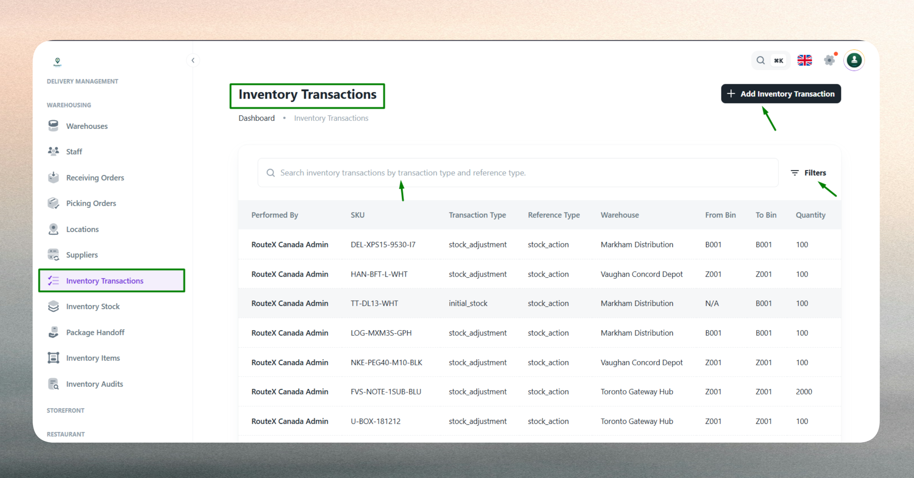
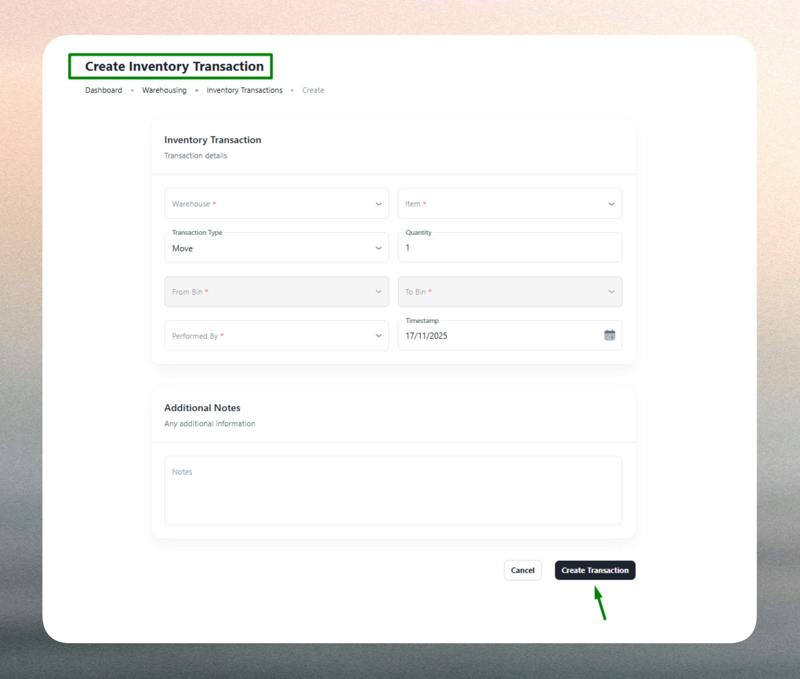

### What is an Inventory Transaction?

An Inventory Transaction records the movement of stock within or between warehouses. Every transaction captures a transfer from a source bin to a destination bin, along with quantity, performer, transaction type, and optional reference details.

Transactions ensure that all inventory movements are traceable, auditable, and reflected accurately in real-time stock levels. They support operational workflows such as stock adjustments, inter-warehouse transfers, zone reorganizations, and damage or loss corrections.

### Purpose

The Inventory Transactions module provides administrators with complete visibility and control over stock flow. It ensures that every movement — whether manual or system-triggered — is logged and categorized for reporting, accountability, and compliance.

Administrators can:

- **Track stock movements** between bins, zones, and warehouses
- **Categorize transactions** by type and reference for reporting clarity
- **Identify performers** to maintain accountability and authorization
- **Maintain audit trails** with timestamps, notes, and full transaction history
- **Resolve discrepancies** using adjustment or correction transaction types

### Transaction List

All inventory transactions are displayed in a centralized list view. This view provides a complete activity log of stock movements across the organization.

   

The list can be filtered by warehouse, SKU, transaction type, date range, or performer to quickly locate specific movements or analyze patterns.

| Column | Description |
| --- | --- |
| **SKU** | Product identifier for the moved item |
| **Transaction Type** | Category such as Transfer, Adjustment, Correction, Return |
| **Reference Type** | Related document or process (e.g., Purchase Order, Sales Order) |
| **Warehouse** | Warehouse where the movement occurred |
| **From Bin** | Source bin or location |
| **To Bin** | Destination bin or location |
| **Quantity** | Number of units transferred |
| **Performed By** | User or staff who executed the transaction |
| **Date** | Timestamp when the transaction was recorded |

> Tip: Use filters to isolate transactions by type or performer during audits or inventory reviews.

### Create a New Transaction

Transactions are created when stock needs to be moved between storage locations or when inventory adjustments are required.

 

Admins initiate transactions by clicking **Add Transaction**. The system then records the details and updates stock levels in both the source and destination bins atomically.

#### Common scenarios for creating transactions:

- **Stock-in/Stock-out**: Recording receiving or fulfillment activities
- **Bin-to-bin transfers**: Reorganizing stock within a warehouse
- **Inter-warehouse transfers**: Moving inventory between facilities
- **Adjustments and corrections**: Fixing count errors or reflecting damaged goods
- **Zone reallocations**: Moving items across storage zones for optimization

#### Fields Description

| Field | Description |
| --- | --- |
| **Warehouse** | The warehouse where the transaction occurs (mandatory). Links the movement to a specific facility. |
| **SKU** | The inventory item being transferred (mandatory). Identifies which stock is affected. |
| **From Bin** | Source bin or storage location (mandatory). Deducts quantity from this location. |
| **To Bin** | Destination bin or storage location (mandatory). Adds quantity to this location. |
| **Quantity** | Number of units to move (mandatory). Must not exceed available stock in the source bin. |
| **Transaction Type** | Category of movement (e.g., Transfer, Adjustment, Return). Defines the purpose for reporting. |
| **Reference Type** | Linked document or process (e.g., PO, SO, Manual Entry). Provides traceability to source workflows. |
| **Performed By** | User or staff executing the transaction (mandatory). Ensures accountability. |
| **Notes** | Optional context or remarks. Useful for justifying adjustments or documenting special conditions. |

> Why: These fields ensure each transaction is fully documented, traceable, and auditable across operational and compliance workflows.

### Best Practices

- **Verify stock availability** in the source bin before creating a transaction.
- **Use correct transaction types** to maintain clear reporting and analytics.
- **Link reference types** when transactions are tied to POs, SOs, or other workflows.
- **Document adjustments** using notes to explain discrepancies or corrections.
- **Review transaction history** regularly to identify trends, errors, or unauthorized movements.
- **Restrict transaction permissions** to authorized personnel only.

:::tip
For bulk movements or recurring transfers, consider automating transactions through Receiving, Picking, or Transfer modules to reduce manual entry and improve accuracy.
:::

:::note
Screenshot placeholder: Transaction detail page
:::
