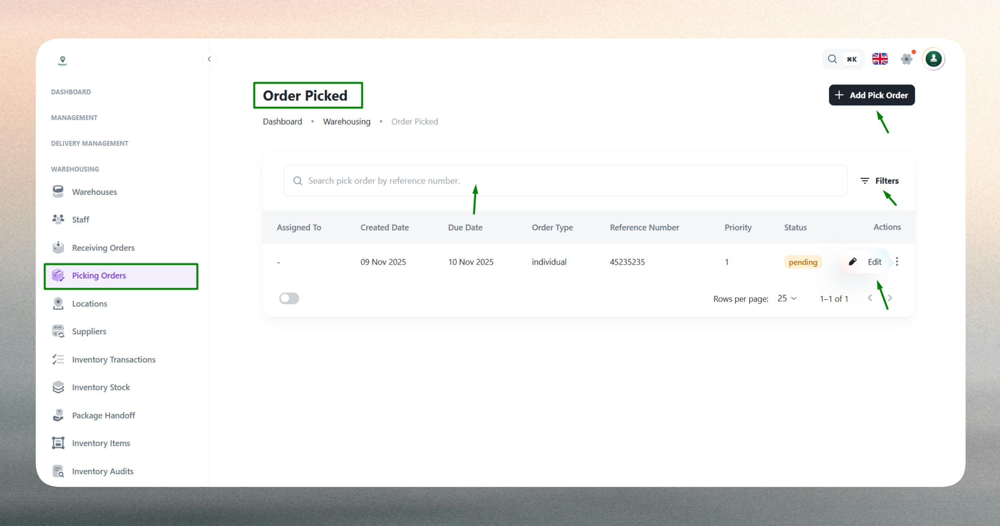
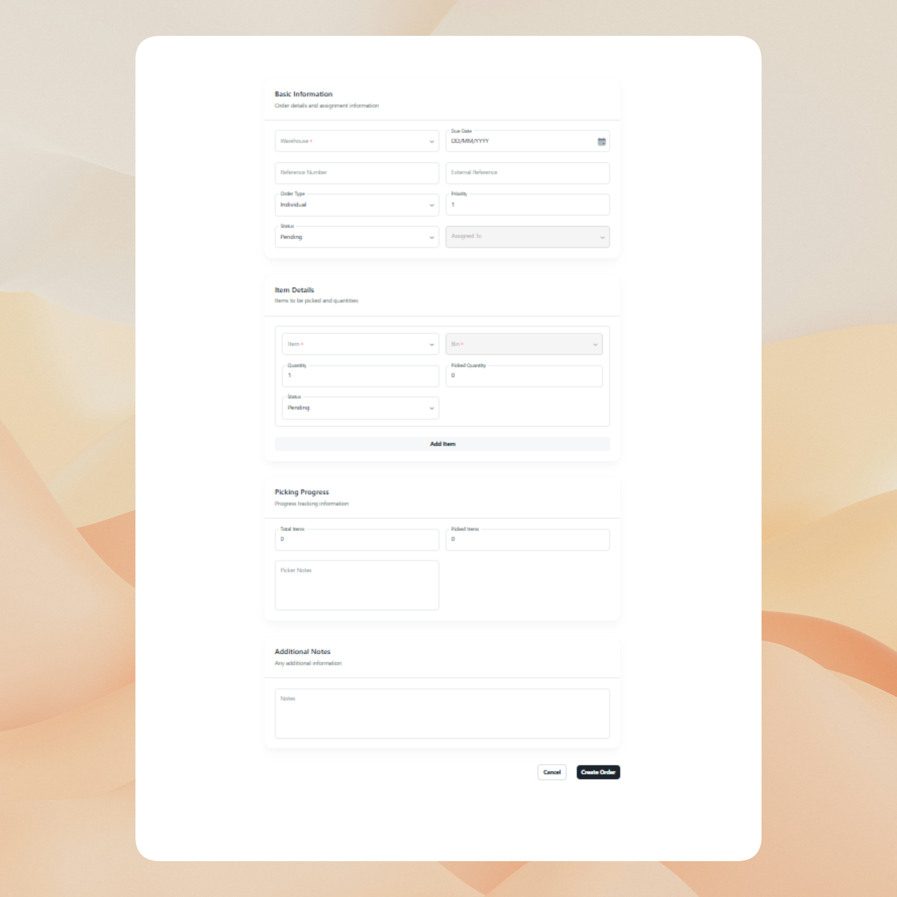
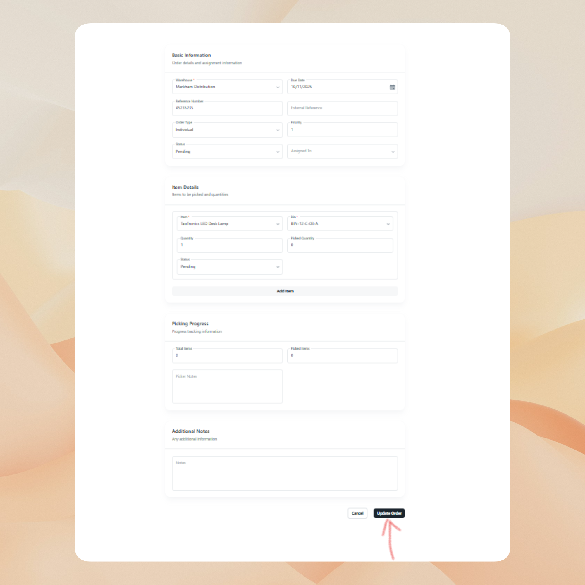

## What is a Picking Order?

A picking order is a warehouse instruction that directs staff to retrieve specific items from inventory in preparation for outbound shipment or fulfillment. Each picking order references a warehouse location, specifies the items and quantities needed, and assigns the task to a responsible team member.

Picking orders bridge the gap between inventory management and order fulfillment. When a customer order is confirmed or a delivery is scheduled, a picking order ensures that the right items are collected from the correct bin locations and staged for packing or dispatch.

> Why it matters: Accurate picking ensures efficient order fulfillment, prevents stock discrepancies, and provides full visibility into warehouse operations.

<!-- screenshot placeholder -->
> [screenshot of picking order concept diagram]

---

## Picking Order List

The Picking Order List displays all picking operations across warehouses, providing a centralized view for monitoring, filtering, and managing picking activities.

**What you can do:**

- **View all picking orders** across warehouses with key details such as warehouse name, reference number, assigned staff, status, and creation date.
- **Filter by status** (Pending, In Progress, Completed) to focus on active tasks or review completed operations.
- **Search by reference number** to quickly locate specific picking orders.
- **Track assignment and accountability** by viewing which staff member is responsible for each order.
- **Monitor progress** in real-time to identify bottlenecks or delays in picking operations.

 

The list view serves as the operational dashboard for warehouse managers, offering insight into current workload, task distribution, and fulfillment readiness.

## Create a New Picking Order

Creating a picking order initiates the process of retrieving items from inventory for outbound fulfillment. This action is typically triggered when a delivery is scheduled, an order is confirmed, or inventory needs to be staged for shipment.

**Purpose:**

Picking orders translate customer orders or delivery schedules into actionable warehouse tasks. By creating a picking order, you define what items need to be collected, from which warehouse, and who is responsible for the task.

**Key considerations:**

- **Warehouse context**: Each picking order is tied to a specific warehouse, ensuring that inventory adjustments and bin locations are accurate.
- **Reference linkage**: Use reference numbers to connect picking orders to external systems such as customer orders, invoices, or delivery manifests.
- **Item specifications**: Include item names, quantities, and bin locations to guide staff to the correct inventory.
- **Assignment and accountability**: Assign the picking task to a specific staff member to track performance and ensure responsibility.
- **Status tracking**: Set the initial status (typically Pending) and update it as the task progresses through In Progress to Completed.

 

Picking orders integrate with inventory stock records and delivery workflows. Completed picking orders may trigger inventory deductions, packing tasks, or shipment notifications.

## Edit an Existing Picking Order

Editing a picking order allows you to update task details, reassign staff, or adjust status as operations evolve. Changes may be necessary due to inventory adjustments, staff availability, or fulfillment corrections.

**Editable fields:**

- **Reference Number**: Update if the external order reference changes.
- **Item Details**: Modify quantities, bin locations, or add/remove items based on revised requirements.
- **Assigned To**: Reassign the task to a different staff member if workload or availability changes.
- **Status**: Transition the order from Pending to In Progress as picking begins, and to Completed once all items are collected and verified.
- **Remarks**: Add notes about special handling, discrepancies, or exceptions encountered during picking.

**Workflow impact:**

- **Status changes** reflect real-time task progress and inform downstream processes such as packing or dispatch.
- **Reassignment** updates accountability and may trigger notifications to the newly assigned staff member.
- **Quantity adjustments** may require validation against current inventory stock to prevent shortages.
- **Completed orders** typically lock the record to preserve audit trails and prevent accidental modifications.

Editing ensures that picking orders remain accurate and aligned with operational realities, supporting smooth fulfillment workflows.

### Best Practices

- Use clear, unique reference numbers to maintain traceability and prevent confusion.
- Update status promptly as tasks progress to provide visibility to managers and downstream teams.
- Validate bin locations and item details before finalizing picking orders to reduce errors.
- Review completed orders periodically to identify patterns, inefficiencies, or training opportunities.

