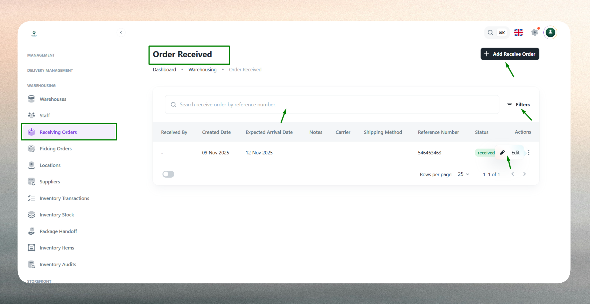
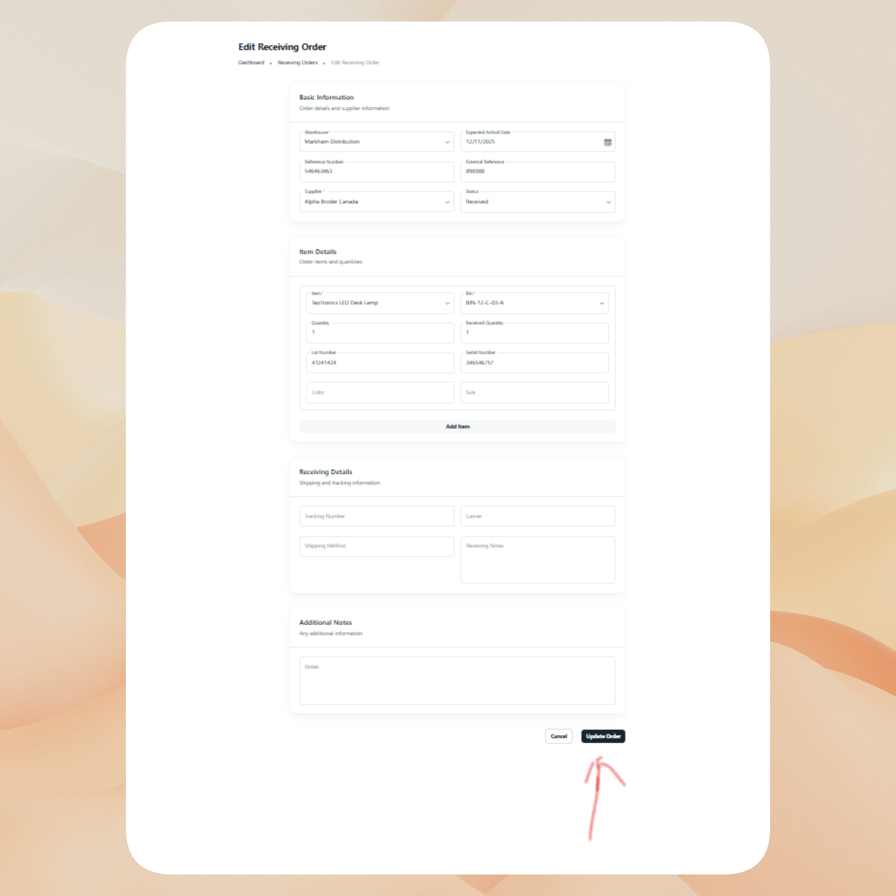

# Receiving Orders

## What is a Receiving Order

A Receiving Order represents an inbound shipment record that tracks expected goods arriving at a warehouse from a supplier. Each order documents the supplier, expected arrival date, item details, and fulfillment status, providing complete visibility into incoming inventory movements.

Receiving Orders form the foundation of inbound logistics management, enabling organizations to:

- **Track inbound shipments**: Monitor expected deliveries from creation through receipt
- **Plan warehouse operations**: Schedule resources and storage allocation based on arrival dates
- **Maintain supplier accountability**: Link shipments to specific suppliers for reconciliation and performance tracking
- **Update inventory accurately**: Ensure stock levels reflect received goods once verified
- **Support audit trails**: Preserve historical records of all incoming goods for compliance and reporting

Proper receiving order management ensures that warehouse teams are prepared for arrivals, incoming goods are verified against expectations, and inventory systems remain accurate across all facilities.

::::note
Screenshot placeholder: Receiving Orders overview page
::::

## Receiving Order List

The Receiving Order List provides a comprehensive view of all inbound shipments across your warehouse network, organized by status, supplier, and expected arrival timeline.

Use the list to monitor pending arrivals, verify receipt confirmations, and manage supplier deliveries. The interface includes:

- **Search functionality**: Quickly locate orders by supplier name, warehouse, or order identifier.
- **Filtering options**: Filter by warehouse location, supplier, status (Pending, In Transit, Received), or date range.
- **Sorting capabilities**: Sort by expected arrival date, creation date, supplier, or status.
- **Quick actions**: Access order details, update status, or modify shipment information directly from the list.

 

The list displays key information such as warehouse destination, supplier source, expected arrival date, current status, and order creation timestamp for easy reference and inbound logistics management.

## Create a New Receiving Order

Creating a Receiving Order establishes a record for expected inbound inventory, linking the shipment to a warehouse, supplier, and arrival schedule. This process enables warehouse teams to prepare for incoming goods and ensures inventory updates occur upon receipt.

Receiving Orders connect procurement activities with warehouse operations by documenting what is expected, when it should arrive, and where it should be stored. Once goods are physically received and verified, the order status transitions to Received, triggering inventory stock updates and maintaining accurate visibility across the supply chain.

 

### Warehouse Assignment

Specify the destination warehouse where goods will be received. The warehouse assignment determines where inventory will be added upon receipt and ensures the correct facility prepares storage capacity and resources. This linkage prevents cross-warehouse confusion and maintains clear operational boundaries for inbound logistics.

### Supplier Identification

Link the receiving order to the supplier responsible for the delivery. Supplier identification maintains traceability for procurement reconciliation, enables supplier performance tracking, and supports accounts payable verification. The system records which supplier provided which goods at which warehouse, forming a complete audit trail for financial and operational reporting.

### Expected Arrival Date

Define when the shipment is scheduled to arrive at the warehouse. The expected arrival date enables resource planning, staff scheduling, and storage preparation. Warehouse teams use this information to allocate dock time, prepare inspection areas, and coordinate receiving activities with other operational priorities.

### Item Details

Optionally specify the products expected in the shipment, including item names, quantities, designated bin locations, and handling remarks. While item details are not mandatory at order creation (useful when complete information is not yet available), providing this data enables:

- **Pre-allocation**: Assign bin locations before goods arrive for faster put-away
- **Verification**: Compare expected quantities against received quantities during inspection
- **Quality control**: Document special handling requirements or inspection notes
- **Inventory planning**: Anticipate stock level changes and prepare for outbound demand

| Field | Purpose |
| --- | --- |
| **Item Name** | Identifies the product or SKU expected in the shipment. |
| **Quantity** | Specifies expected units to be received for verification during inspection. |
| **Bin Location** | Designates the storage area for placement upon receipt. |
| **Remarks** | Documents special handling, quality requirements, or inspection notes. |

Item-level documentation improves receiving accuracy and warehouse organization, though orders can be created without complete item information when supplier details are not yet finalized.

### Status Tracking

Set the receiving order's current stage to reflect its position in the inbound logistics workflow:

- **Pending**: Order created; shipment not yet dispatched by supplier
- **In Transit**: Goods shipped and en route to the warehouse
- **Received**: Shipment arrived, inspected, and verified by warehouse team

Status tracking enables real-time visibility into inbound operations, helps identify delays, and ensures only verified receipts trigger inventory updates. Warehouse teams update status as shipments progress, maintaining accurate operational state across the logistics network.

### Validation

The system validates all required fields and enforces business rules to maintain data integrity. Warehouse and supplier selections are mandatory, expected arrival dates must be current or future dates, and item quantities (when provided) must be numeric. The system prevents duplicate receiving orders for the same supplier and date combination, ensuring each inbound shipment is uniquely tracked. Validation errors are highlighted for correction before submission.

## Edit an Existing Receiving Order

Receiving Orders can be updated at any time to reflect changes in shipment details, arrival schedules, or fulfillment status.

Common updates include:

- **Status progression**: Advance orders from Pending to In Transit as suppliers confirm shipment, then to Received once warehouse teams verify arrival and complete inspection.
- **Arrival date adjustments**: Update expected delivery dates when suppliers communicate schedule changes or delays, enabling warehouse teams to adjust resource planning.
- **Item detail refinement**: Add or modify item-level information as suppliers provide complete shipping manifests or when partial shipments alter expected quantities.
- **Bin location updates**: Revise storage assignments based on actual warehouse capacity or inventory placement strategies at time of receipt.
- **Supplier corrections**: Update supplier information if initial records were incorrect or if shipment responsibility transferred between vendors.

 

Editing receiving orders ensures warehouse operations remain aligned with actual inbound logistics, maintains accurate expectations for arriving goods, and supports dynamic inventory planning. The system retains historical data for audit trails, reconciliation, and supplier performance analysis.

:::tip
Advance status to Received only after physical verification by warehouse teams. Use bin locations consistently for faster put-away and retrieval. Update arrival dates promptly when suppliers communicate delays to maintain accurate warehouse scheduling.
:::

:::note
Keep receiving orders current—especially status and arrival dates—to ensure warehouse teams have accurate information for resource planning and to prevent inventory discrepancies.
:::

:::info
Review pending and in-transit orders regularly to identify potential delays. Coordinate with suppliers when expected arrival dates pass without receipt to maintain supply chain visibility.
:::

