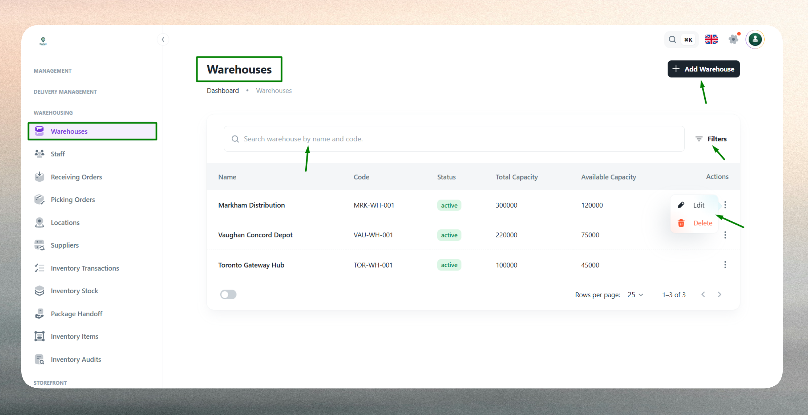
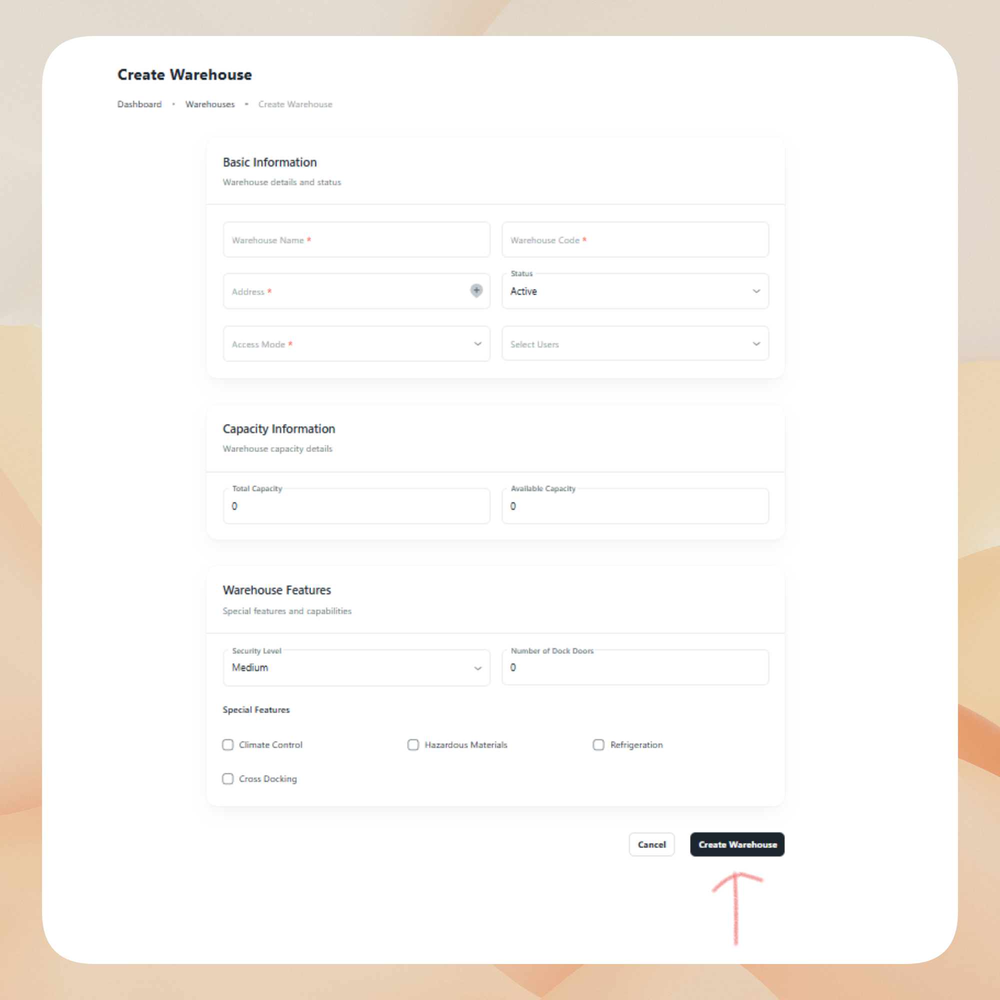
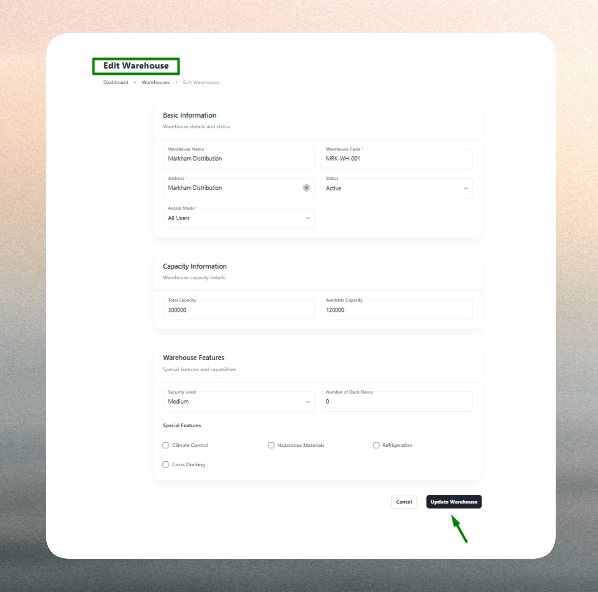

# Warehouses

The Warehouses module enables administrators to register and manage storage and distribution facilities across the organization. Each warehouse record defines where deliveries are dispatched from, where returned items are received, and what resources are available at that location.

## What is a Warehouse?

A warehouse represents a physical facility where goods are stored, dispatched, or received. Each warehouse profile includes identification details, location coordinates, storage capacity, special features (such as climate control or refrigeration), and access permissions.

Warehouses form a core part of the logistics infrastructure, enabling:

- **Order fulfillment**: Dispatch outbound deliveries from designated facilities.
- **Returns management**: Receive and process returned or failed deliveries.
- **Inventory control**: Track stock levels and storage utilization across locations.
- **Regional operations**: Support multi-facility networks with zone-specific warehouses.

Proper warehouse configuration ensures efficient routing, accurate stock tracking, and secure access control across logistics processes.

## Warehouse List

The Warehouse List provides a comprehensive view of all registered warehouses in your network.

Use the list to monitor facility status, verify capacity, and manage access permissions. The interface includes:

- **Search functionality**: Quickly locate warehouses by name, code, or address.
- **Filtering options**: Filter warehouses by status (Active/Inactive), special features, or access mode.
- **Sorting capabilities**: Sort by name, code, capacity, or recent activity.
- **Quick actions**: Access warehouse details, edit profiles, or change status directly from the list.

 

The list displays key information such as warehouse name, unique code, address, storage capacity, special features, access mode, and current status for easy reference.

## Create a New Warehouse

Creating a warehouse profile requires entering key information across several categories to ensure accurate facility management and operational efficiency.

 

### Basic Information

Provide the warehouse's identification details including a clear, identifiable name (e.g., "Central Distribution Hub") and a unique warehouse code (e.g., `WH-001`). The warehouse code must be unique and follow your organization's naming conventions for accurate tracking and reporting.

### Address & Location Details

Enter the full physical address including street, city, state, and postal code to ensure accurate routing and nearest-facility assignment. Optionally provide geo-coordinates (latitude and longitude) to enable mapping, route optimization, and distance calculations for delivery planning.

### Capacity & Features

Define the maximum storage capacity (e.g., cubic meters, pallets, or square footage) to help track utilization and prevent over-allocation. Specify special features such as Climate Control, Refrigeration, Hazardous Material Storage, or Security Systems to indicate suitability for specific product types and ensure compliance with storage requirements.

### Access Control

Configure who can view and manage the warehouse using access modes:

- **All Users**: Visible to everyone in the organization.
- **Include Users**: Visible only to selected users or roles.
- **Exclude Users**: Visible to all except selected users or roles.

Access control ensures only authorized personnel can view or modify warehouse information, supporting security and accountability across facilities.

### Status & Validation

Set the warehouse's operational status (Active or Inactive). Active warehouses are available for dispatch and receiving operations, while Inactive status excludes them from selection during maintenance or closure.

The system validates all required fields and enforces business rules. Warehouse names and codes are mandatory, addresses must be properly formatted, and duplicate warehouse codes are not allowed. Any validation errors are highlighted for correction before submission.

## Edit an Existing Warehouse

Warehouse profiles can be updated at any time to reflect changes in capacity, features, or operational status.

Common updates include:

- **Capacity adjustments**: Update storage limits as facilities expand or contract.
- **Feature modifications**: Add or remove special capabilities like refrigeration or climate control.
- **Address corrections**: Update location details for accuracy in routing and reporting.
- **Status changes**: Toggle between Active and Inactive status for maintenance, closures, or seasonal operations.
- **Access control updates**: Modify user permissions as staffing or security policies change.
- **Code or name changes**: Standardize naming conventions across the network (use caution with code changes as they may affect integrations).

 

Editing warehouse profiles ensures accurate dispatch operations, maintains compliance with storage requirements, and supports dynamic facility management. The system retains historical data for reporting and auditing purposes.

:::note
Keep warehouse details current—especially capacity, features, and status—to maintain accurate inventory planning and prevent dispatch errors.
:::

:::tip
Use consistent naming and code conventions (e.g., `WH-1001`, `WH-1002`) across facilities for easier management and reporting. Assign access strategically to balance security with operational flexibility.
:::

:::info
Mark warehouses as Inactive instead of deleting them if they are temporarily unavailable or under renovation. This preserves historical data and allows for easy reactivation.
:::

